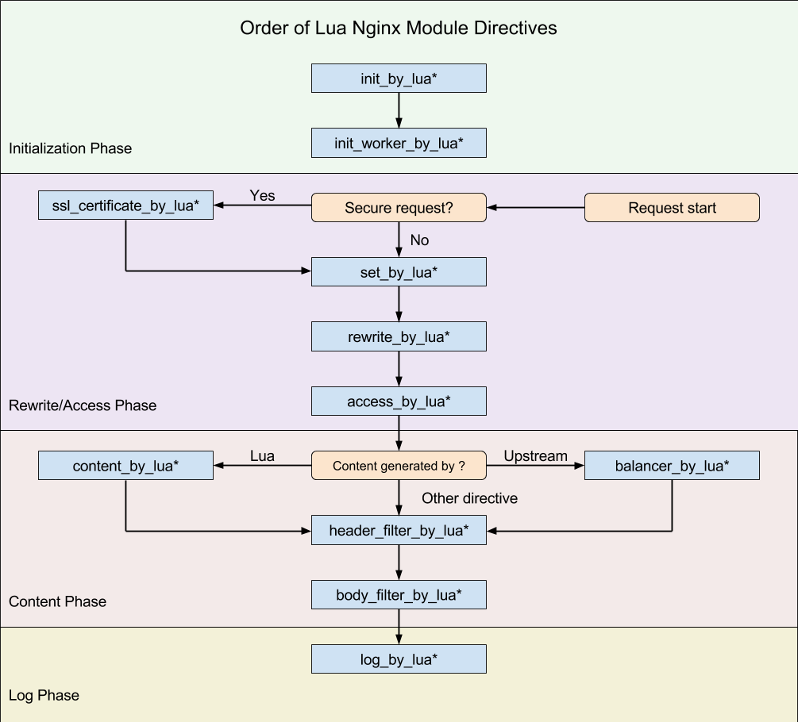

## 概览
&emsp;&emsp;kong是一个基于nginx和OpenResty模块构建的API网关服务。提供http请求路由，后端服务负载均衡以及通过丰富的插件提供认证鉴权、流量调控、日志监控等功能。该网关目前应用在全球著名的API管理站点[mashape](https://market.mashape.com/explore?page=1)上。  
&emsp;&emsp;nginx是一个采用异步I/O，事件驱动的高性能Web服务器，也可以作为在企业内部提供基于http rpc的反向代理和负载均衡器。由于nginx的配置都是以静态文件的方式提供，而且nginx一般都是多台部署，导致nginx的运维管理变得比较复杂。许多运维的小伙伴都会写一些运维脚本，自动通过ssh命令远程连接到服务器去做一些配置更新的操作。  
&emsp;&emsp;笔者所在公司也开发过一个基于nginx的软负载中心。用户可以在平台上为自己的服务配置反向代理以及负载均衡策略。用户所有的操作都会打包成一次对nginx配置的修改。修改指令会发送到每台nginx部署的一个agent上，最后由agent完成nginx配置文件的更新。  
&emsp;&emsp;这些方法虽然可以达到自动化的管理nginx，但是本质上还是通过配置文件的方式去改变nginx的一些固定行为。在企业里面，特别是互联网公司常常需要定制一些功能。虽然可以为nginx开发一些模块，但是门槛较高，需要对nginx源码级的掌握。OpenResty为nginx引入的LuaJIT和lua-nginx-module，使我们可以在nginx的各个执行阶段编写一些lua脚本，极大地扩展了nginx的功能。OpenResty的作者已经用lua开发了许多工具库，使得我们可以在nginx中访问MySQL、Memcached、Redis。kong在此基础上实现了一个API网关服务。

<!--more-->

## 导读

### 如何阅读源码
&emsp;&emsp;想必看这边文章的许多朋友之前对nginx都略有了解，但是可能是头一次接触lua语言，笔者当时也是头一次。这种情况笔者一般不会一上来就去阅读源码，而是先阅读下官方文档，把环境搭建起来之后试用下功能，然后看下日志。这样会对这个系统有个整体的感觉，之后就可以去翻翻源码了。笔者所使用的编辑器是IntelljIDEA，它可以自动识别出lua语言，然后提示你去下载支持该语言的插件，很是方便。笔者全程是在ubuntu环境下开发的，使用linux系统的好处是改完代码后执行下make命令，然后reload下nginx就可以看到效果。使用windows的童鞋建议装个linux的虚拟机。由于调试kong比较麻烦，所以笔者都是通过加日志的方式学习代码的。选取一些关键的流程打印一些数据会对源码的学习起到事半功倍的效果。有时候在troubleshooting的时候更加需要打印许多日志才能把问题定位到。  
&emsp;&emsp;笔者使用的kong的版本为0.12.1

### 如何使用该文档
&emsp;&emsp;本文档作为源码导读，在阅读本文档时手头最好有一份kong的源码以便随时进入源码深入阅读。读者不必从头到尾进行通读，可以根据目录选择自己感兴趣的章节进行阅读。

### 源码结构
|-- kong  
&emsp;&emsp;|-- api [admin管理接口的代码]  
&emsp;&emsp;&emsp;&emsp;|-- ...   
&emsp;&emsp;|-- cluster_events [集群事件的数据访问层代码]  
&emsp;&emsp;&emsp;&emsp;|-- ...  
&emsp;&emsp;|-- cmd [kong命令行的代码]  
&emsp;&emsp;&emsp;&emsp;|-- ...  
&emsp;&emsp;|-- core [请求处理、路由、负载均衡等核心代码]  
&emsp;&emsp;&emsp;&emsp;|-- ...  
&emsp;&emsp;|-- dao [数据库访问层代码]  
&emsp;&emsp;&emsp;&emsp;|-- ...  
&emsp;&emsp;|-- plugins [插件的代码]  
&emsp;&emsp;&emsp;&emsp;|-- ...  
&emsp;&emsp;|-- templates [nginx配置文件模板]  
&emsp;&emsp;&emsp;&emsp;|-- ...  
&emsp;&emsp;|-- tools [工具类代码]  
&emsp;&emsp;&emsp;&emsp;|-- ...  
&emsp;&emsp;|-- vendor [这里提供了用于lua面向对象编程的基类]  
&emsp;&emsp;&emsp;&emsp;|-- ...  
&emsp;&emsp;|-- cache.lua [缓存实现类，封装了mlcache]  
&emsp;&emsp;|-- cluster_events.lua [集群事件同步代码]  
&emsp;&emsp;|-- conf_loader.lua [配置加载]  
&emsp;&emsp;|-- constants.lua [常量定义]  
&emsp;&emsp;|-- init.lua [kong的入口，可以从这里开始阅读代码]  
&emsp;&emsp;|-- meta.lua [定义版本号之类]  
&emsp;&emsp;|-- mlcache.lua [封装了lua-resty-mlcache]  
&emsp;&emsp;|-- singletons.lua [单例模式，存放公共对象]  

### 执行入口
&emsp;&emsp;以下是kong的nginx配置文件，笔者把一些和本章主题无关的先去掉了。  


init_by_lua_block {
    kong = require 'kong'
    kong.init()
}
init_worker_by_lua_block {
    kong.init_worker()
}
upstream kong_upstream {
    server 0.0.0.1;
    balancer_by_lua_block {
        kong.balancer()
    }
    keepalive 60;
}
server {
    server_name kong;
    listen 0.0.0.0:8000;
    location / {     
        rewrite_by_lua_block {
            kong.rewrite()
        }
        access_by_lua_block {
            kong.access()
        }
        header_filter_by_lua_block {
            kong.header_filter()
        }
        body_filter_by_lua_block {
            kong.body_filter()
        }
        log_by_lua_block {
            kong.log()
        }
    }
    location = /kong_error_handler {
        internal;
        content_by_lua_block {
            kong.handle_error()
        }
    }
}


&emsp;&emsp;可以看到kong的代码执行入口在init_by_lua_block块中，该块中的代码会在nginx的master加载配置的时候被执行。通过require 'kong'得到的实例是一个全局对象，在Lua虚拟机里面执行的代码都可以访问到。
该实例通过master的fork进程方法共享给worker，如果worker修改该实例会触发操作系统进程的copy-on-write，worker进程就会拥有该实例的一个副本。  
&emsp;&emsp;后缀是by_lua_block的都代表nginx处理请求的一个执行阶段，每个阶段都会执行相应的kong代码。nginx执行阶段流程如下如所示:  

- init_by_lua*  
&emsp;&emsp;发生在master进程启动阶段。这里会对数据访问层进行初始化，加载插件的代码，构造路由规则表。  
- init_worker_by_lua*  
&emsp;&emsp;发生在worker进程启动阶段。这里会开启数据同步机制，执行每个插件的init_worker方法。  
- set_by_lua*  
&emsp;&emsp;处理请求第一个执行阶段。这里可以做一些流程分支处理判断变量初始化。kong没有使用该阶段。
- rewrite_by_lua*  
&emsp;&emsp;这里可以对请求做一些修改。kong在这里会把处理代理给插件的rewrite方法。  
- access_by_lua*  
&emsp;&emsp;kong在这里对请求进行路由匹配，找到后端的upstream服务的节点。  
- balancer_by_lua*  
&emsp;&emsp;kong在这里会把上一阶段找到的服务节点设置给nginx的load balancer。如果设置了重试次数，此阶段可能会被执行多次。  
- header_filter_by_lua*  
&emsp;&emsp;这里可以对响应头做一些处理。kong在这里会把处理代理给插件的header_filter方法。  
- body_filter_by_lua*  
&emsp;&emsp;这里可以对响应体做一些处理。kong在这里会把处理代理给插件的body_filter方法。  
- log_by_lua*  
&emsp;&emsp;kong在这里会通过插件异步记录日志和一些metrics数据。  

### 核心模块
&emsp;&emsp;kong有三大核心模块：请求路由(Router)、负载均衡(Balancer)和集群数据同步。这3个模块加上插件就组成了kong的所有功能。
&emsp;&emsp;路由和负载均衡模块完全接管了nginx本身的策略，也是作为一个网关的核心功能。集群数据同步则弥补了nginx集群管理的缺点，可以使得路由规则和负载均衡策略的修改可以动态进行，省去了修改配置文件和重启的流程。       
        
## Router

### 概览
&emsp;&emsp;路由是Kong的核心功能之一。Kong会代理HTTP请求，根据HTTP主机头、请求URI和请求方式(GET/POST等)匹配路由规则，找到实际处理请求的后端服务。

&emsp;&emsp;Kong的路由规则由HTTP主机头、请求URI和请求方式组成。规则匹配发生在Nginx的Rewrite/Access阶段中，access_by_lua_block指令块里面的kong.access()方法的前置handler中。见[kong-nginx.conf:85](https://github.com/cstoppgmr/material/blob/master/articles/APIGateway/nginx-kong.conf#L85)  

&emsp;&emsp;路由规则的原始数据存储在数据库apis表中。HTTP主机头由表字段hosts描述、请求URI由表字段uris描述、请求方式由表字段methods描述。在MySQL中，这3个字段的数据存储格式都是JSON序列化之后字符串数组。apis的表结构描述如下： 
 

CREATE TABLE `apis` (
  -- guid
  `id` varchar(64) NOT NULL,
  -- 名称
  `name` varchar(255) NOT NULL,
  -- upstream标识
  `upstream_url` varchar(1023) NOT NULL,
  -- 是否保留主机头
  `preserve_host` tinyint(1) NOT NULL,
  -- 主机头匹配
  `hosts` varchar(1023) DEFAULT NULL,
  -- uri匹配
  `uris` varchar(1023) DEFAULT NULL,
  -- 请求方法匹配
  `methods` varchar(1023) DEFAULT NULL,
  -- 是否只接受https的请求
  `https_only` tinyint(1) DEFAULT '0',
  -- 如果接受https的请求并且客户端IP不在授信IP中，是否终止请求
  `http_if_terminated` tinyint(1) DEFAULT '0',
  -- 由于链路问题(connection timeouts, connection resets等或者5xx错误)导致请求转发失败重试次数
  `retries` smallint(6) DEFAULT '5',
  -- 如果是uri前缀匹配，是否剥离掉uri前缀
  `strip_uri` tinyint(1) DEFAULT '1',
  -- 一些超时时间
  `upstream_connect_timeout` int(11) DEFAULT '60000',
  `upstream_send_timeout` int(11) DEFAULT '60000',
  `upstream_read_timeout` int(11) DEFAULT '60000',
  `created_at` timestamp(3) NOT NULL DEFAULT CURRENT_TIMESTAMP(3),
  PRIMARY KEY (`id`),
  UNIQUE KEY `name` (`name`),
  KEY `apis_name_idx` (`name`)
) ENGINE=InnoDB DEFAULT CHARSET=utf8 ROW_FORMAT=DYNAMIC;


&emsp;&emsp;路由规则的创建在Nginx的初始化阶段，init_by_lua_block指令块中的kong.init()方法里。见[kong-nginx.conf:26](https://github.com/cstoppgmr/material/blob/master/articles/APIGateway/nginx-kong.conf#L26)  

&emsp;&emsp;在kong.init()的末尾调用core.build_router(dao, "init")方法构造路由表。见[init.lua:174](https://github.com/Kong/kong/blob/master/kong/init.lua#L174)。  

&emsp;&emsp;build_router方法的第一个参数是一个数据库操作对象，会使用它查询出数据库apis表中的数据。第二个参数是一个路由表在缓存中的版本号。如果apis表的数据发生变化，会触发缓存的invalidate操作，生成出一个新的version。此时在kong.access()方法中会再次调用build_router对路由表进行重建。见[handler.lua:336](https://github.com/Kong/kong/blob/master/kong/core/handler.lua#L336)。  

&emsp;&emsp;build_router会对从apis表中查询出来的数据按创建时间created_at从小到大进行排序。见[handler.lua:54](https://github.com/Kong/kong/blob/master/kong/core/handler.lua#L54)。这样如果2条规则相同的话较早的规则会优先匹配。接着会构造一个Router对象，它会负责路由表的创建、路由规则的匹配操作。  

### 生成规则

&emsp;&emsp;Router对象的第一个核心功能就是把数据库中的apis数据转化为适合进行匹配的规则。规则类型有3种：HOST、URI和METHOD，见[router.lua:56](https://github.com/Kong/kong/blob/master/kong/core/router.lua#L56)。这3种类型分别由位标识0x01、0x02和0x04表示。3种类型组成7种匹配方式：  
+ HOST and URI and METHOD，位标识为(0x01 | 0x02 | 0x04) == 0x07
+ HOST and URI，位标识为(0x01 | 0x02) == 0x03
+ HOST and METHOD，位标识为(0x01 | 0x04) == 0x05
+ METHOD and URI，位标识为(0x04 | 0x02) == 0x06
+ HOST，位标识为0x01
+ URI，位标识为0x02
+ METHOD， 位标识为0x04  

&emsp;&emsp;创建规则前会先把数据库里存储的apis对象格式化成api_t对象，api_t格式如下：  


api_t      = {
    -- 数据库里面的apis对象
    api            = api,
    -- 是否对URI按前缀进行剥离
    strip_uri      = api.strip_uri,
    -- 请求转发的时候是否保留原始主机头
    preserve_host  = api.preserve_host,
    -- 7种匹配方式的位标识
    match_rules    = 0x00,
    -- 主机头匹配规则，当作数组使用
    hosts          = {},
    -- uri匹配规则，当作数组使用
    uris           = {},
    -- method匹配规则，当作词典使用
    methods        = {},
    -- upstream信息
    upstream_url_t = {},
  }


&emsp;&emsp;如果主机头匹配里面包含通配符，如：*.example.com，则把通配表达式转成正则表达式：.+\\\\.example\\\\.com$，然后hosts字段里面存储的对象格式为： 
 

{
    wildcard = true,
    value    = '*.example.com',
    regex    = '.+\\.example\\.com$',
}


&emsp;&emsp;如果主机头匹配里面是普通的字符串，如：abc.example.com，那么hosts字段里面存储的对象格式为：  


{
    value    = abc.example.com,
}


&emsp;&emsp;使用正则表达式：^[a-zA-Z0-9\.\-_~/%]*$ 判断uri匹配是否是一个普通的uri前缀。如果是，如：/prefix/some，则uris字段里面存储的对象格式为：


{
    is_prefix = true,
    value    = '/prefix/some',
}
 

&emsp;&emsp;如果uri匹配是包含正则字符串，如：/users/\d+/profile，则uris字段里面存储的对象格式为：  


{
    is_regex     = true,
    value        = '/users/\d+/profile',
    regex        = '/users/\d+/profile',
    has_captures = false,
    strip_regex  = '/users/\d+/profile/?(?<stripped_uri>.*)',
}
  

&emsp;&emsp;如果method匹配是get方式，则会把get转成大写，如：GET，以此作为key放入methods词典中。

&emsp;&emsp;使用一个词典数据结构categories对api_t对象以7种匹配方式进行归类。词典的key为7种匹配方式的位标识：0x01、0x02、0x03、0x04、0x05、0x06、0x07，value里面会按host、uri和method对规则进行分组。value定义如下：  


{
    -- 按host分组的规则，词典类型
    apis_by_hosts   = {},
    -- 按uri分组的规则，词典类型
    apis_by_uris    = {},
    -- 按method分组的规则，词典类型
    apis_by_methods = {},
    -- 该匹配模式下所有规则，数组类型
    all             = {},
}
 

&emsp;&emsp;如果一个匹配规则是hosts=[abc.com]、uris=[/path]、method=[GET]，那么categories会包含此规则的api_t对象。如下所示：  


{
    7 = {
      apis_by_hosts   = {
        abc.com = [api_t对象]
        },
      apis_by_uris    = {
        /path = [api_t对象]
        },
      apis_by_methods = {
        GET = [api_t对象]
        },
      all             = [api_t对象],  
    }
}
 

&emsp;&emsp;如果另一个匹配规则是hosts=[abc.com]、uris=[/version]，那么categories会包含此规则的api_t对象2。如下所示：  


{
    3 = {
      apis_by_hosts   = {
        abc.com = [api_t对象2]
        },
      apis_by_uris    = {
        /version = [api_t对象2]
        },
      all             = [api_t对象2],  
    },
    7 = {
      apis_by_hosts   = {
        abc.com = [api_t对象]
        },
      apis_by_uris    = {
        /path = [api_t对象]
        },
      apis_by_methods = {
        GET = [api_t对象]
        },
      all             = [api_t对象],  
    }
}
 

&emsp;&emsp;另外使用一个词典数据结构plain_indexes和3个数组结构uris_prefixes、uris_regexes、和wildcard_hosts决定优先使用哪种匹配模式。它们的创建方式见[router.lua:252](https://github.com/Kong/kong/blob/master/kong/core/router.lua#L252)。首先会使用plain_indexes匹配主机头、uri和请求方法，因为它的构造是一个词典结构，可直接根据主机头、uri和请求方法进行查询，效率比较高。plain_indexes的内容如下： 
  

{
    hosts = {
      abc.com   = true,
    },
    uris = {
      /foo = true,
    },
    methods = {
     GET = true
    }
}
  

&emsp;&emsp;如果在plain_indexes里面没有查询到的话，则使用uris_prefixes、uris_regexes、和wildcard_hosts里面的规则一个一个进行匹配，直到匹配成功为止。

### 匹配流程

&emsp;&emsp;规则的匹配在kong.access方法里面，调用router.exec方法进行匹配。见[handler.lua:354](https://github.com/Kong/kong/blob/master/kong/core/handler.lua#L354)。  

&emsp;&emsp;router.exec方法从http请求里面获取主机头信息、HTTP请求方法和请求URI。然后调用find_api方法进行实际地匹配。见[router.lua:594](https://github.com/Kong/kong/blob/master/kong/core/router.lua#L594)。   

&emsp;&emsp;find_api首先从缓存里面查询匹配结果。如果缓存里面没有数据，则是第一次匹配。先把请求中的主机头放入ctx.req_host，请求uri放入ctx.req_uri，请求方法放入ctx.req_method。然后使用plain_indexes、uris_prefixes、uris_regexes、和wildcard_hosts选择匹配模式。这里如果是根据uri前缀、uri正则表达式或主机头通配符匹配到的话，则会把uri前缀或uri正则表达式放入ctx.hits.uri中，把主机头通配符放入ctx.hits.host中。后续就使用ctx去和规则进行匹配。匹配模式按照CATEGORIES定义的顺序进行降级匹配。如果匹配模式是0x07，则使用0x07里面的规则去匹配。如果匹配失败，则使用0x03的规则进行匹配。如果还是失败，则继续按0x05 -> 0x06 -> 0x01 -> 0x02 -> 0x04的降级顺序进行匹配，直到成功为止。  

&emsp;&emsp;确定匹配模式之后，先使用reduce方法对候选的规则进行筛选。前面说到每一种匹配模式包含的规则会按host、uri和method进行分组。reduce方法就是选取数量最少的那个分组。如果那个分组下的规则匹配失败，则使用all下面的规则进行匹配。  

&emsp;&emsp;现在举例说明。假设现在根据如下json创建了一个apis对象。  


{
    "name": "my-api",
    "upstream_url": "http://my-api.com",
    "hosts": ["example.com", "service.com"],
    "uris": ["/foo", "/bar"],
    "methods": ["GET"]
}
 

&emsp;&emsp;对应的api_t内容是：  


api_t      = {
    api            = 数据库中的api对象,
    strip_uri      = false,
    preserve_host  = false,
    match_rules    = 0x07,
    hosts          = [
                      {
                                value    = example.com,
                      },
                      {
                                value    = service.com,
                      }
    ],
    uris           = [
                      {
                                is_prefix = true,
                                value    = '/foo',  
                      },
                      {
                                is_prefix = true,
                                value    = '/bar',  
                      }
    ],
    methods        = {GET = true},
    upstream_url_t = {
                         scheme             = http,
                         host               = my-api.com,
                         port               = 80,
    }
  }
  

&emsp;&emsp;categories内容如下：  


{
    7 = {
      apis_by_hosts   = {
        example.com = [api_t],
        service.com = [api_t]
        },
      apis_by_uris    = {
        /foo = [api_t],
        /bar = [api_t],
        },
      apis_by_methods = {
        GET = [api_t]
        },
      all             = [api_t],  
    }
}
 

&emsp;&emsp;plain_indexes的内容如下：  


{
    hosts = {
      example.com   = true,
      service.com   = true
    },
    uris = {
      /foo = true,
      /bar = true
    },
    methods = {
     GET = true
    }
}
 

&emsp;&emsp;uris_prefixes的内容如下：  


[
    {
      is_prefix = true,
      value    = '/foo',  
    },
    {
      is_prefix = true,
      value    = '/bar',  
    }
]
 

&emsp;&emsp;由于host匹配没有通配符以及uri匹配没有正则表达式，所以uris_regexes和wildcard_hosts为空。  

&emsp;&emsp;假设现在有如下请求：  


GET /foo HTTP/1.1
Host: example.com
 

&emsp;&emsp;此请求的主机头是example.com，请求uri是/foo，请求方法是GET。首先使用plain_indexes确定匹配模式为0x07，因为plain_indexes.hosts包含example.com，位标识是0x01。plain_indexes.uris包含/foo，位标识是0x02。plain_indexes.methods包含GET，位标识是0x04。把0x01，0x02和0x04通过位或运算得到0x07。  
   
&emsp;&emsp;根据0x07从categories里选择key为7的规则。reduce方法等价于:  
`min(#categories[7].apis_by_hosts[example.com], #categories[7].apis_by_uris[/foo], #categories[7].apis_by_methods[GET])`  
&emsp;&emsp;#号是取数组的长度。此处这3个数组的长度都是1，所以优先选择apis_by_hosts中的api_t规则进行匹配。  api_t里面的hosts、uris和methods匹配上了这个请求，此次匹配成功。  

## Balancer

### 概览
&emsp;&emsp;Balancer对请求做负载均衡，使请求分散地转发到后端服务。从而可以优化资源利用率、提升吞吐量、减少延时以及提高容错等。Kong使用了DNS-Balancer和Ring-Balancer两种均衡模式。DNS-Balancer适合对外部的第三方服务进行负载均衡。候选服务器列表添加在A记录或SRV记录中。A记录中只包含IP地址，而且没有权重信息，适合简单的round-robin。SRV记录中包含IP地址和端口，并含有权重信息，可以按权重调拨流量以及IP地址复用。Ring-Balancer适合对内部服务进行负载运行。因为这种模式的控制性强，可以灵活地支持机器上下线操作、带权重的负载均衡以及可以进行蓝绿部署和金丝雀发布。本章着重分析Ring模式。  

### Ring-Balancer
&emsp;&emsp;在Kong里面，Ring-Balancer通过upstream和target对象描述。upstream对象用于调节负载均衡的行为，如权重分配、健康检查以及是否通过一致性hash绑定请求到对应的机器上。target存储进行负载均衡的机器列表。  

&emsp;&emsp;upstream对象数据库表结构描述如下：  


CREATE TABLE upstreams (
  id varchar(64) NOT NULL,
  name varchar(255) DEFAULT NULL,
  
  -- 槽位大小，用于调节权重
  slots int(11) NOT NULL,
  -- json格式存储的健康检查配置
  healthchecks varchar(10000) DEFAULT NULL,
  -- 首选hash输入值：none,consumer,ip,header
  hash_on varchar(31) DEFAULT NULL,
  -- 此选hash输入值
  hash_fallback varchar(31) DEFAULT NULL,
  -- 根据http header进行hash时，首选的header
  hash_on_header varchar(255) DEFAULT NULL,
  -- 此选的header
  hash_fallback_header varchar(255) DEFAULT NULL,
  
  created_at timestamp(3) NOT NULL DEFAULT CURRENT_TIMESTAMP(3),
  PRIMARY KEY (id),
  UNIQUE KEY name (name),
  KEY upstreams_name_idx (name)
) ENGINE=InnoDB DEFAULT CHARSET=utf8 ROW_FORMAT=DYNAMIC;
 

&emsp;&emsp;target对象数据库表结构描述如下：  


CREATE TABLE targets (
  id varchar(64) NOT NULL,
  
  -- ip:port
  target varchar(500) NOT NULL,
  -- 权重值
  weight int(11) NOT NULL,
  -- 所属upstream
  upstream_id varchar(64) DEFAULT NULL,
  
  created_at timestamp(3) NOT NULL DEFAULT CURRENT_TIMESTAMP(3),
  PRIMARY KEY (id),
  KEY tragets_upstreamid_fk (upstream_id),
  KEY targets_target_idx (target),
  CONSTRAINT tragets_upstreamid_fk FOREIGN KEY (upstream_id) REFERENCES upstreams (id) ON DELETE CASCADE
) ENGINE=InnoDB DEFAULT CHARSET=utf8 ROW_FORMAT=DYNAMIC;
 

#### 构造balancer

&emsp;&emsp;Ring-Balancer的初始化发生在nginx工作进程的初始化阶段中，init_worker_by_lua_block指令块的kong.init_worker()方法里，见[nginx-kong.conf:30](https://github.com/cstoppgmr/material/blob/master/articles/APIGateway/nginx-kong.conf#L30)。init_worker里面调用了balancer.init()方法做了实际的初始化工作。  

&emsp;&emsp;balancer.init首先使用get_all_upstreams方法从数据库upstreams表加载所有数据到缓存中。调用create_balancer方法对每个查询出来的upstream对象，创建一个负载均衡器ring_balancer。均衡器的实现在resty.dns.balancer模块中，这个模块在Kong的lua-resty-dns-client项目里，代码见[github](https://github.com/Kong/lua-resty-dns-client)，文档见[resty.dns.balancer](https://kong.github.io/lua-resty-dns-client/modules/resty.dns.balancer.html)。  

&emsp;&emsp;均衡器初始化使用了3个参数：wheelSize,order和dns，见[balancer.lua:295](https://github.com/Kong/kong/blob/0.12.1/kong/core/balancer.lua#L295)。在0.12.1版本中，实际使用的就wheelSize这一个参数。如果wheelSize越大，目标机器的分布就越离散。这样在选择的时候既可以保证权重，连续选到相同的机器的概率也比较小。当然wheelSize越大，占用的内存就越多，重建的开销比较大。可以根据后端机器的数量选择的一个值，它的默认值是1000。  

#### 加载target
&emsp;&emsp;fetch_target_history方法会从key为balancer:targets:${upstreamId}的缓存中选择upstream下面的target，如果缓存中没有就调用load_targets_into_memory方法从数据库中查询出来再放入缓存。  
&emsp;&emsp;Kong的api没有对target按ip和端口进行修改的操作。(这是因为如果只是做添加操作的话，可以不重建balancer，减少开销，见[balancer.lua:364](https://github.com/Kong/kong/blob/0.12.1/kong/core/balancer.lua#L364)。但是在check_target_history方法中有一个bug，导致即使只是添加target，还是会重建balancer，bug见[balancer.lua:357](https://github.com/Kong/kong/blob/0.12.1/kong/core/balancer.lua#L357)，这里把old_history和new_history写反了。)  
&emsp;&emsp;由于只做添加，数据库表targets中可能会出现多条target相同的数据(ip和port相同)，但是权重是不同的数据。如果出现这种情况该决定使用哪个target记录呢?fetch_target_history方法会对查询出来的target记录按创建时间进行从老到新的排序，见[balancer.lua:116](https://github.com/Kong/kong/blob/0.12.1/kong/core/balancer.lua#L116)。之后apply_history方法会按这个顺序把target添加到均衡器ring_balancer中，如果ip和端口相同，ring_balancer中后添加的记录会覆盖之前的，见[balancer.lua:314](https://github.com/Kong/kong/blob/0.12.1/kong/core/balancer.lua#L314)。 

&emsp;&emsp;无论是Ring-Balancer或DNS-Balancer，都是使用resty.dns.balancer这个负载均衡器做的负载均衡。这是因为在调用resty.dns.balancer的addHost方式时。如果hostname传的是域名的话，会做dns解析，把解析出来的节点添加进去。但如果hostname是ip地址的话，直接把添加参数所表示的节点。文档见[addHost](https://kong.github.io/lua-resty-dns-client/modules/resty.dns.balancer.html#addHost)

#### target健康检查
&emsp;&emsp;create_healthchecker方法为每个负载均衡器ring_balancer添加健康检查。
健康检查的实现在resty.healthcheck模块中，这个模块在Kong的lua-resty-healthcheck项目里，代码见[github](https://github.com/Kong/lua-resty-healthcheck)，文档见[resty.healthcheck](https://kong.github.io/lua-resty-healthcheck/modules/resty.healthcheck.html)。
&emsp;&emsp;create_healthchecker使用如下代码构造健康检查器：  


local healthchecker, err = healthcheck.new({
   name = upstream.name,
   shm_name = "kong_healthchecks",
   checks = upstream.healthchecks,
 })
 

&emsp;&emsp;shm_name传递的是lua-resty-healthcheck需要的nginx中的共享内存名，用于存储当前哪些节点的失败或成功次数。定义见[nginx-conf:21](https://github.com/cstoppgmr/material/blob/master/articles/APIGateway/nginx-kong.conf#L21)。

&emsp;&emsp;checks传递的是健康检查的json配置。健康检查有主动检查和被动检查2种。  
   
&emsp;&emsp;主动检查需要设置检查url、超时时间、检查间隔、失败判断码、失败判断次数、成功判断码、成功判断次数、超时判断次数等。  
&emsp;&emsp;kong默认的主动检查配置如下(这个配置不会启用主动检查，因为tcp_failures、timeouts、http_failures、interval和successes都被设成了0)：


"active":{
    "unhealthy":{
        "http_statuses":[
            429,
            404,
            500,
            501,
            502,
            503,
            504,
            505
        ],
        "tcp_failures":0,
        "timeouts":0,
        "http_failures":0,
        "interval":0
    },
    "http_path":"/",
    "timeout":1,
    "healthy":{
        "http_statuses":[
            200,
            302
        ],
        "interval":0,
        "successes":0
    },
    "concurrency":10
}
 

&emsp;&emsp;kong会根据配置定期对后端服务节点机器调用检查url进行检查，如果检查超时或HTTP返回码满足失败条件的次数超过限制，负载均衡器会把该节点标记为不可用。 

&emsp;&emsp;被动检查需要设置失败判断码、失败判断次数、成功判断码、成功判断次数、超时判断次数等。  
&emsp;&emsp;kong默认的被动检查配置如下(这个配置不会启用被动检查，因为tcp_failures、timeouts、http_failures和successes都被设成了0)：  


"passive":{
    "unhealthy":{
        "http_failures":0,
        "http_statuses":[
            429,
            500,
            503
        ],
        "tcp_failures":0,
        "timeouts":0
    },
    "healthy":{
        "http_statuses":[
            200,
            201,
            202,
            203,
            204,
            205,
            206,
            207,
            208,
            226,
            300,
            301,
            302,
            303,
            304,
            305,
            306,
            307,
            308
        ],
        "successes":0
    }
}
 

&emsp;&emsp;kong在跟后端机器进行通信的过程中，判断其返回码，有无超时。然后根据配置决定是否对节点进行标记。     

&emsp;&emsp;由于被动检查的操作是在负载均衡器里面进行，attach_healthchecker_to_balancer里面对负载均衡器设置了report_http_status和report_tcp_failure方法，这2个方法会在转发请求的时候被调用，把请求结果通知给健康检查器，见[balancer.lua:249](https://github.com/Kong/kong/blob/0.12.1/kong/core/balancer.lua#L249)。
&emsp;&emsp;这里要注意下如果被动检查把一个节点标记为不可用的话，即使该节点已经恢复了，kong也不会自动地把该节点添加进balancer中。需要用户手动调用一个管理接口进行恢复，见[文档](https://getkong.org/docs/0.12.x/health-checks-circuit-breakers/#passive-health-checks-circuit-breakers)。  

&emsp;&emsp;构造完健康检查器后，调用populate_healthchecker方法把负载均衡器中节点添加到健康检查器中。然后调用attach_healthchecker_to_balancer监听健康检查器的事件：healthchecker.events.healthy和healthchecker.events.unhealthy，并设置回调方法。回调方法就是根据健康检查器的事件类型，在负载均衡器中把后端节点标记为可用或不可用，见[balancer.lua:229](https://github.com/Kong/kong/blob/0.12.1/kong/core/balancer.lua#L229)。 

#### 选择target
&emsp;&emsp;当请求匹配出一条路由规则之后，就会在该规则下面的target中选一个目标实例进行转发。目标实例的选择发生在kong.access()的后置handler中，调用balancer.execute方式进行选择。target的选择全权委托给了resty.dns.balancer对象，见[balancer.lua:689](https://github.com/Kong/kong/blob/0.12.1/kong/core/balancer.lua#L689)。  
&emsp;&emsp;选择target的算法是带权重的round-robins。普通的round-robins算法把所有候选的target放入一个数组中，确定一个数组的起始元素(一般取第一个)。之后每次选择的时候按顺序往后选一个，到末尾时再从头开始遍历。带权重的round-robins算法相似，也是遍历数组。只不过数组的大小会远远超过target的数量，resty.dns.balancer初始化的时候wheelSize就是指定这个数组的大小。wheelSize和每个target的权重值确定一个target在数组中分配的数量，然后随机选择数组的位置进行放入。

## 集群间数据同步

### 概览
&emsp;&emsp;kong的代码运行于nginx的worker进程中。kong对数据的修改会在一个worker中进行，数据被修改后需要通知给本地的其他worker进程和其他机器上的worker进程。kong使用的进程间通信主要方式有：1. 本机间通信-共享内存 2. 跨机器通信-数据库。  

### 数据共享
&emsp;&emsp;kong的数据存储在数据库中，同时在缓存中保留一份。当数据库的中的数据被修改时，需要发出相应的事件通知其他worker。其他worker接收事件后，删除缓存中对应的数据。下次从缓存读数据时发现没有的话，就从数据库加载出来。  
&emsp;&emsp;事件分为本地事件和集群事件。本地事件用于通知在一台机器上的worker，集群事件用于通知在多台机器上的worker。

#### 共享内存
&emsp;&emsp;本地事件通过共享内存实现。kong实现了一套基于nginx共享内存的事件发布-订阅机制，源码见仓库[lua-resty-worker-events](https://github.com/Kong/lua-resty-worker-events)。该包提供post_local方法在worker进程内进行事件发布，提供post方法在同属于一台机器上的worker进程间进行事件发布。这2个方法需要指定source和event来确定事件源。  
&emsp;&emsp;kong的数据访问层[dao.lua](https://github.com/Kong/kong/blob/0.12.1/kong/dao/dao.lua)封装了insert、update和delete三个对数据操作的方法。这三个方法分别会使用post_local发出source为dao:crud，event为insert、delete、update的数据增、删、改的事件。事件的数据格式如下:  


{
   schema    = self.schema, --表名
   operation = "create", --操作类型
   entity    = res, --数据
}
 

&emsp;&emsp;worker进程启动的时候会在init_worker阶段注册这些事件的订阅方法，见[handler.lua:97](https://github.com/Kong/kong/blob/0.12.1/kong/core/handler.lua#L97)。订阅方法中把所有的dao:crud事件按表名称使用post_local再进行分发。所以从dao:crud分发的事件如下:  
- source=crud, event=apis  
这个事件会通知所有的worker(包含不同机器)apis数据的修改。这里对缓存中对key为router:version进行invalidate操作会发送一条channel=invalidations集群事件。  
- source=crud, event=targets  
这个事件会通知所有的worker(包含不同机器)targets数据的修改。使用cluster_events:broadcast方法发送一条channel=balancer:targets集群事件。
- source=crud, event=upstreams  
这个事件会通知所有的worker(包含不同机器)upstreams数据的修改。使用cluster_events:broadcast方法发送一条channel=balancer:upstreams集群事件。

#### 数据库

&emsp;&emsp;集群事件通过数据库实现。数据库表cluster_events存放用于集群间分发的事件。cluster_events表结构如下:  


CREATE TABLE cluster_events (
  id varchar(64) NOT NULL,
  -- 标识生成事件的节点id
  node_id varchar(64) NOT NULL,
  -- 事件产生时间，精确到毫秒 
  at timestamp(3) NOT NULL,
  -- 事件生效时间，精确到毫秒
  nbf timestamp(3) NULL DEFAULT NULL,
  -- 事件过期时间，精确到毫秒
  expire_at timestamp(3) NOT NULL,
  -- 事件类型
  channel varchar(1023) DEFAULT NULL,
  -- 事件数据
  data varchar(10000) DEFAULT NULL,
  
  PRIMARY KEY (id),
  KEY cluster_events_at_idx (at),
  KEY cluster_events_channelt_idx (channel)
) ENGINE=InnoDB DEFAULT CHARSET=utf8 ROW_FORMAT=DYNAMIC;
 

channel的类型有:  
- invalidations  
表示路由规则、插件配置的变更
- balancer:targets  
表示负载均衡的targets列表发生变更
- balancer:upstreams  
表示upstream对象发生变更
- balancer:post_health  
表示target的健康状态发生变更。由于被动健康检查拉出实例后，kong不会在对该实例进行自动拉入，需要通过该事件来拉入实例。  

&emsp;&emsp;调用cluster_events:broadcast方法会往cluster_events表中新增一条记录。在init_worker阶段通过调用cluster_events:subscribe会开启一个定时器，定时查询出cluster_events表中新增的记录。这里要注意的是同一台机器上只会有一个worker进程会对数据库进行查询(通过加锁实现，代码见[cluster_events:303](https://github.com/Kong/kong/blob/0.12.1/kong/cluster_events.lua#L303))，查询出来后再通过共享内存的方式通知给这台机器上的其他worker。  
&emsp;&emsp;配置参数db_update_frequency确定查询数据库的间隔，默认为5秒。数据范围根据at字段是否落在(起始时间, 结束时间]确定。起始时间第一次设置在init_worker阶段，调用ngx.now()获取当前时间(精确到毫秒)并放入key为cluster_events:at的共享内存中。之后抢到锁的worker会从共享内存中取出该时间，该时间需要减去db_update_propagation + 0.001来确定起始时间，以防止事件丢失。配置参数db_update_propagation默认为0。结束时间取ngx.now()的值。查询成功后会把结束时间覆盖之前的起始时间，并把该事件分发到本机的其他worker。对于设置了nbf的事件，kong如果发现还没到生效时间，就会通过ngx.timer设置一个定时器延后分发该事件。  

## Plugin

### 概览
&emsp;&emsp;kong的插件可以在不修改kong本身源码的情况下方便地添加一些功能。插件不仅可以处理请求，还可以定义API，操作数据库。kong本身提供了许多插件，支持鉴权认证、安全控制、流量调控和请求报文转换等。见[plugins list](https://konghq.com/plugins/)   

### 执行原理
&emsp;&emsp;每个插件都需要放置在plugins目录下。这里有个[base_plugin.lua](https://github.com/Kong/kong/blob/0.12.1/kong/plugins/base_plugin.lua)文件，定义了一个每个插件都需要去继承的基类。该基类定义了一些每个子类都需要去实现的方法，kong在每个执行阶段会调用。插件需要定义一个handler.lua文件，在这个文件里面去实现子类。此外还需要定义一个schema.lua文件，在这里定义每个插件的配置数据。    
&emsp;&emsp;在nginx的master启动阶段，会扫描plugins目录下面的所有插件，加载handler.lua和schema.lua中定义的模块，见[kong/init.lua:78](https://github.com/Kong/kong/blob/0.12.1/kong/init.lua#L78)。  
&emsp;&emsp;数据库中的plugins表定义了需要启用的插件。只有在这张表里面存在的插件，并且是开启状态的才会被使用。  
&emsp;&emsp;插件还可以定义一个api.lua文件，用于暴露一些api接口。如oauth2插件。kong在nginx的配置文件里面开启了8001端口，所有的管理api都暴露在这个端口上。它会调用kong/init.lua中的serve_admin_api方法，使用lapis模块加载api/routes/init.lua，初始化管理接口。这里也会加载插件的api.lua，加载插件的接口，见[api/init.lua:158](https://github.com/Kong/kong/blob/0.12.1/kong/api/init.lua#L158)。  
&emsp;&emsp;在每个请求的执行阶段，都会先执行kong的前置处理方法，然后遍历所有启用的插件执行每个阶段对应的方法。如果读者看过base_plugin的文件话会发现基本上所有的方法都会传一个conf参数。这个就是在plugins表中定义的每个插件需要用到的配置。遍历插件的时候会从缓存里面加载插件配置，如果缓存失效就会从数据里面重新加载一遍。我们可以触发invalidations集群事件来动态的更新插件配置。见[core/plugins_iterator.lua](https://github.com/Kong/kong/blob/0.12.1/kong/core/plugins_iterator.lua)。