## 前言
&emsp;&emsp;从去年下半年开始到今年上半年时间，我一直致力于容器云平台PaaS系统的建设。从概念设计到整体架构，我全程参与其中，期间经历过激烈的争吵讨论最终定型，上个月底已经上到生产环境接收第一个版本的流量冲击考验。
&emsp;&emsp;当时纠结于是否直连和代理两种方式实现微服务之间的调用。走直连模式会带来客户端升级的问题，比如版本冲突和兼容，走代理模式会带来性能损耗，但是微服务之间调用的客户端实现可以非常轻量，同时也给代理网关层提出了非常苛刻的要求。当时领导想的很简单，采用zuul网关去做这层代理，我很快实现出来，还发现了netflix的ribbon客户端的一些bug。下图是领导设计的第一版架构图：
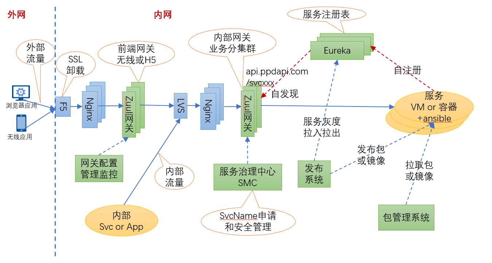

&emsp;&emsp;上图采用zuul做内网网关，服务之间调用使用服务名+http协议通过zuul网关发起调用，网关层面去做服务发现和负载均衡，这样服务之间调用的客户端就会很轻量，这和当下的service mesh的理念也比较契合。但是这里面最核心的问题，zuul采用的同步调用，意味着一个请求会占用一个线程，在极端情况下会导致线程数爆增。再有就是这套东西很难和目前公司的esb相兼容，这样导致这个新体系只能接受新项目，老项目还不能嵌入到我们的发布体系中。可能老大也是考虑这个原因，参考携程的基于nginx的slb来替换内网zuul网关。其实早在携程我就研读过nginx的源码，对第一版slb的源码也很熟悉，到平安以后研究过点评的slb方案camel源码。客观评价，携程slb源码的代码质量和组织架构不敢恭维，相对而言camel更优秀一些。其实私底下，我和团队成员说了，完全可以参考camel定制我们自己的slb。后来确实携程slb的代码没法进行下去，这么重要的东西，必须完全掌握才行，而且领导的这版本只是发包，还不是发的docker镜像。
&emsp;&emsp;后期架构就演变成nginx做内网网关，在nginx层上做负载均衡，流量切换和服务治理，发布系统改成基于mesos的调度方式，相对于上图，架构变化很大。我们加班加点确实做完了，代码质量确实不错，临到快要上线的时候，领导想法又变了，slb废弃掉，采用直连的模式。然后我跟领导说，我来重新设计整个体系，其实我是去携程交流以后有的一个大概想法，下面是我设计的架构图：
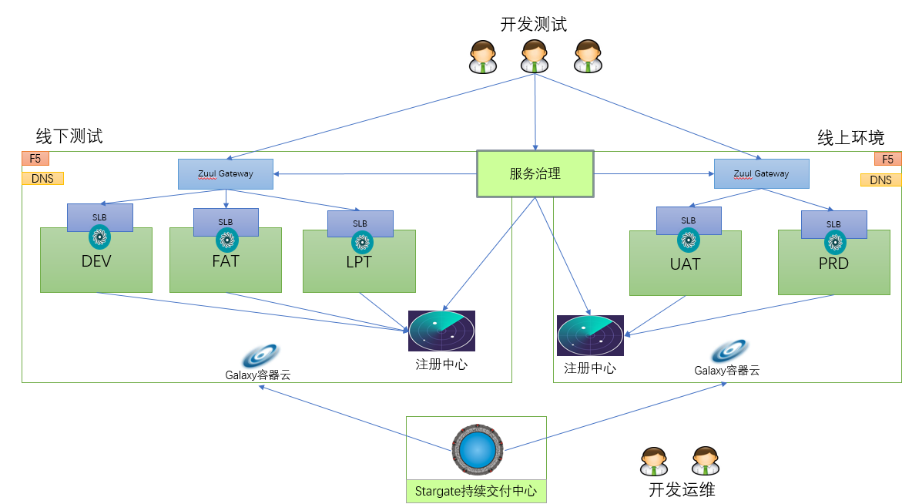

&emsp;&emsp;可以从图中看到，虽然是直连，我还是把slb放到架构里面了，当时的一个想法是想和目前的esb体系兼容，这样用新框架的服务也能被老的服务调用，因为服务总得要有一个域名，不然这个新的服务框架很难被用起来。新服务之间的调用是很省事，通过服务名就可以了，然后服务框架提供客户端。其实我当时设计还有另一层考虑，我是负责无线网关和H5网关的，如果有域名，这样无线网关就能直接复用老的方式，不用从新做调整。而且前面也讨论过，直连和走代理的方式，直连还是存在一些问题，要不然service mesh现在也不会这么有市场。所以我的方案是取了个折中，直连和代理都走的通，方便后期切换，而且兄弟们开发了这么久的slb，好歹劳动成果不能浪费，源码我也看了还是比较靠谱，而且前期争论过多，小组成员还有点小矛盾了。后面和领导争取了，不知道他是故意的还是我没有表达清楚，把我的方案直接给否定了。下面是领导给的第二份架构：
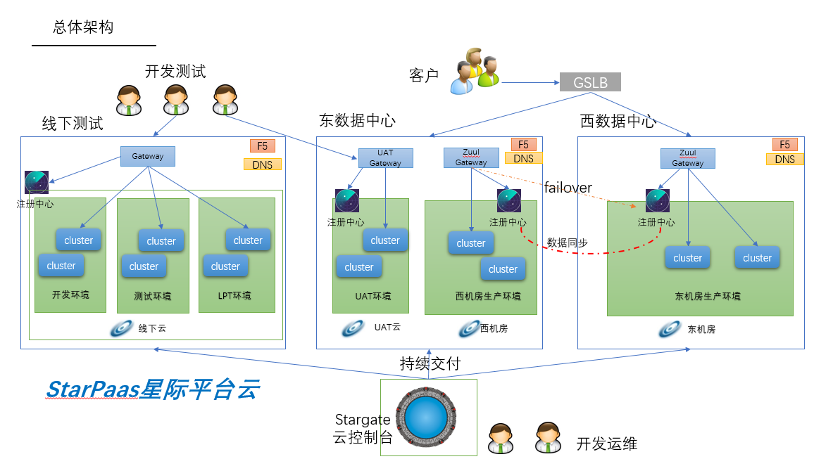

&emsp;&emsp;从上图中可以看到没有代理层了，服务之间调用是直连模式。如果是一家从零开始的公司，这套方案到没什么，但是彻底断绝了和现有服务框架兼容的可能性。新服务调用老的esb服务麻烦，老的服务调用新的框架服务也麻烦，更严重的是直连会带来治理的困难。我原先是做过分布式缓存，对客户端版本升级有过切肤之痛。好吧，领导说这么办就这么办，我虽然做的是容器调度，但是对微服务rpc框架也很有兴趣，以前也看过dubbo和motan的源码，我自己也按照这套方式写了一个RPC框架[finix](https://github.com/jinfei21/finix/)，有兴趣的可以看看代码。基于这种直连方式，我设计的发布流程如下：
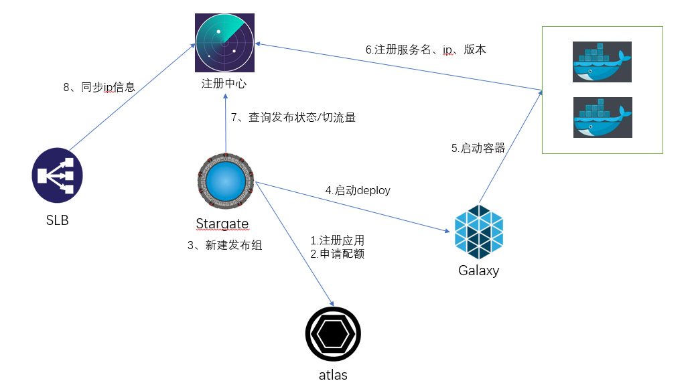

&emsp;&emsp;这段插曲还没完，做到年底快上线的时候，领导想法又变了，说直连不好要换代理模式。哥还是太单纯，和领导顶撞了一下，不是当面顶撞，只是在企业微信群里面就事论事，我说一个方案好不好不是我们闭门造车想一出是一出，应该先定一个设计目标，实现方式有很多种，如果是不确定，那能不能搞一个折中方案，方便切换。我知道变化是很正常的事情，但是都快上线了，中间实现的期间怎么没提出，快上线了提出，不是一次两次了。团队其它想做成事的人估计也有想法，只是经验老道不说，有的是老江湖了就迎合，其实我也是现在想通的。我原先在平安也和产品撕过逼，产品经理上周需求方案是一种，晚上回去我想实现，下周来上班发现需求全部变了，我是经历过这种情况的。但是中间件需求相对来说还是比较集中，这么来回的变就失去原则了。
&emsp;&emsp;好吧，经过数次的交锋，最终在集体智慧的努力下定型最终版本，连发布模型也变了，架构设计图如下：
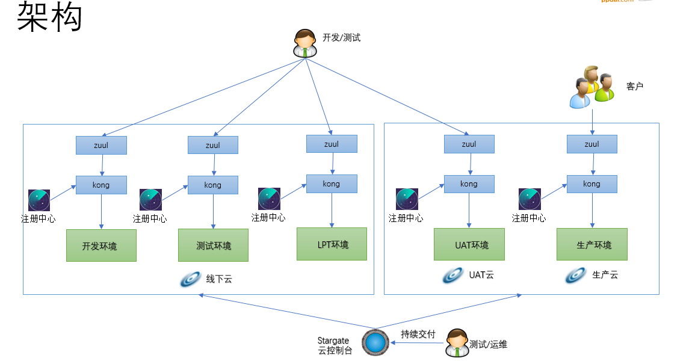

&emsp;&emsp;从上图中可以看出代理层从slb换成kong了，之所以换是因为nginx是单机版本的，不是集群版本，每次变更都得更新所有机器的配置文件。实现比较复杂，而且一致性还不一定能保证很好，而kong的配置采用的是数据库存储，天生就支持集群，而且kong从0.11版本以后，变成无状态的了，扩容缩容相当方便，并提供了插件机制可以方便做一些扩展。这块目前是我负责的，也没有做太多的改动，首先是把数据库替换了，换成了mysql，然后就是定制了一个kong的界面管理系统和同步协调器，同步注册中心的一些配置，比如域名集群和IP等信息，相对来说我定制的管理界面是直接操作数据库的，在事务性方面比开源产品直接调用kong admin api的要可靠很多。所以整个的发布流程就是如下的：
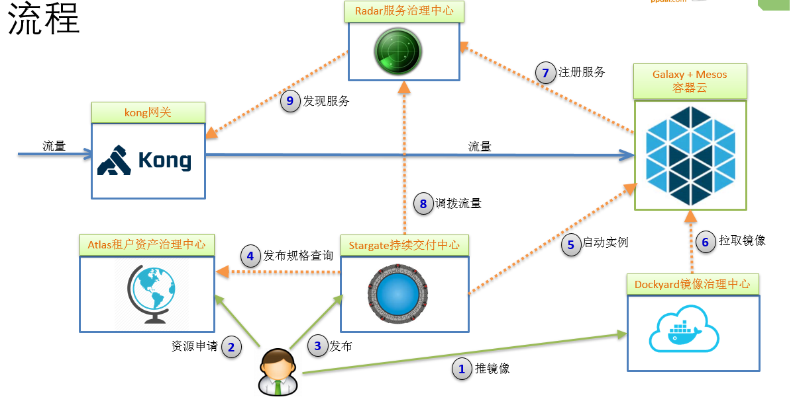

&emsp;&emsp;首先用户参考我们提供的demo工程，在自己的项目工程pom文件中添加相应maven插件配置，执行相关命令把镜像推送到镜像治理中心。第二步，就是到我们的资产管理中心atlas去申请资源配额，资源配额是按照部门申请的，如果已经申请了就不用再申请，当然如果配额不够了可以申请扩容，这样既能保证资源治理比较合理，也能减少用户操作步骤。第三步，用户可以使用发布系统发布相应的镜像，在发布镜像之前，用户必须选择发布的规格，需要多少CPU和内存，发布系统会去altas去检查是否有剩余配额可以使用，如果不够就提示用户申请扩容，如果可以就进入第五步调用galaxy的api发布容器实例。到了第六步，galaxy通过向mesos发起调度task，这时mesos的执行器启动docker容器，docker engine会拉取镜像。docker镜像启动以后，会将appid，appname，cluster，ip等相关信息注册到radar注册中心。最终这些信息在第九步的时候同步到kong网关。发布系统可以根据发布类型，比如蓝绿部署，金丝雀部署修改注册中心的状态。

&emsp;&emsp;以上就是过去一年多经历的架构演进，走到今天相当不容易。我目前是负责基于mesos的容器调度系统，下面我就重点介绍这块内容。

## 正文
&emsp;&emsp;其实在做这个之前，我是毫无头绪的，以前做一个单一系统对我来说不是太难，一旦涉及到跨系统交互，确实有点难为我了。期间我调研了kubernetes，marathon，singularity等相关的东西，也看了docker和虚拟网络相关的东西。kubernetes对我们来说是黑盒子，而且整体架构又复杂，通过和饿了么的同事交流，kubernete他们试下来并不太稳定，所以最终我们决定是上mesos。基于mesos的容器调度，在携程和饿了么都已经经过生产级验证，稳定性和可靠性方面还是比较有保证。
&emsp;&emsp;我实现的基于mesos的容器调度系统主要是参考的singularity，因为singularity使用的是java开发的，不像marathon是scala开发的，只不过singularity搞的过于复杂，而且数据和状态全部存储在zookeeper里面，我自己正常测试和非正常测试下来，不太稳定，如果是zookeeper的数据模型被破坏，就有可能造成不可用，还有可能造成cpu和内存泄露。所以我只是参考它的源码，采用springboot+mysql的方式来重新定制调度逻辑，到现在为止，已经迭代了三个版本。

### Mesos原理
&emsp;&emsp;在介绍调度系统之前，有必要先了解一下mesos的整体架构原理。同其他大部分分布式系统一样，Apache Mesos为了简化设计，也是采用了master/slave结构，为了解决master单点故障，将master做得尽可能地轻量级，其上面所有的元数据可以通过各个slave重新注册而进行重构，故很容易通过zookeeper解决该单点故障问题。其官网给出的架构如下图所示：
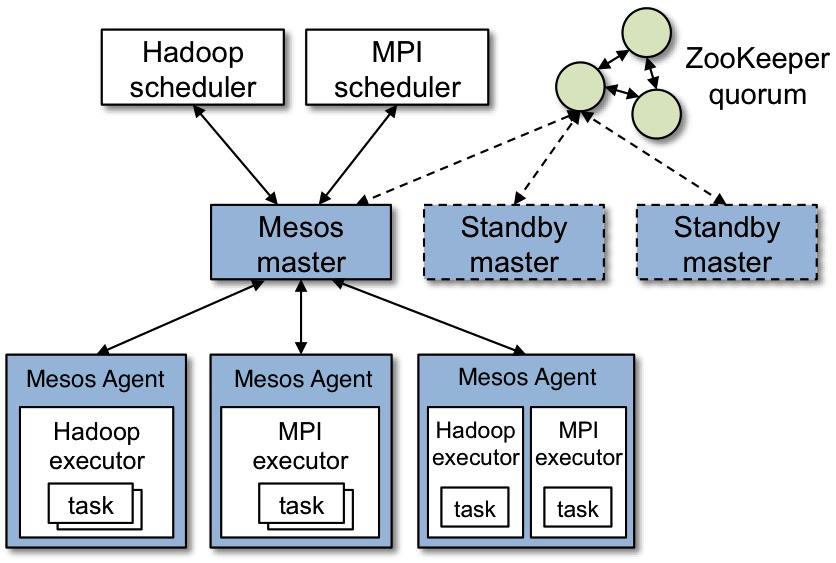
&emsp;&emsp;从图中可知Apache Mesos由四个组件组成，分别是Mesos-master，mesos-slave，framework和executor。
(1) Mesos-master：整个系统的核心，负责管理接入mesos的各个framework和slave，并将slave上的资源按照某种策略分配给framework。
(2) Mesos-slave：负责接收并执行来自mesos-master的命令、管理节点上的mesos-task，并为各个task分配资源。mesos-slave将自己的资源量发送给mesos-master，由mesos-master中的Allocator模块决定将资源分配给哪个framework，当前考虑的资源有CPU和内存两种，也就是说，mesos-slave会将CPU个数和内存量发送给mesos-master，而用户提交作业时，需要指定每个任务需要的CPU个数和内存量，这样，当任务运行时，mesos-slave会将任务放到包含固定资源的linux container中运行，以达到资源隔离的效果。
(3) Framework：是指外部的计算框架，如Hadoop，Mesos等，这些计算框架可通过注册的方式接入mesos，以便mesos进行统一管理和资源分配。Mesos要求可接入的框架必须有一个调度器模块，该调度器负责框架内部的任务调度。当一个framework想要接入mesos时，需要修改自己的调度器，以便向mesos注册，并获取mesos分配给自己的资源， 这样再由自己的调度器将这些资源分配给框架中的任务，也就是说，整个mesos系统采用了双层调度框架：第一层，由mesos将资源分配给框架；第二层，框架自己的调度器将资源分配给自己内部的任务。
(4) Executor：主要用于启动框架内部的task。由于不同的框架，启动task的接口或者方式不同，当一个新的框架要接入mesos时，需要编写一个executor，告诉mesos如何启动该框架中的task。当然也可以用mesos默认的执行器。

&emsp;&emsp;我实现的容器调度系统galaxy，就相当于是实现一个mesos的framework，负责接受来自mesos-master的资源，根据实际需要决定是否启动容器。整个过程如下图所示：
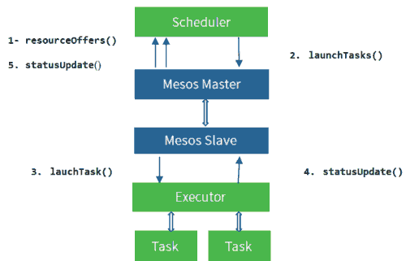
&emsp;&emsp;第一步，调度器通过实现resourceOffers接口，接受来自mesos-master的空闲offer（包含目前空闲的cpu内存磁盘），第二步，调度器根据一定规则匹配，是否满足需求，如果满足就调用lanchTasks向mesos-master发起调用进入第三步，否则就直接拒绝offer。第三步，mesos-master向mesos-slave发指令启动task，这时mesos-slave收到指令后，开始向executor发起task调用，或是启动容器，或是启动jar包。启动完成之后，进入第四步，执行器会将task的状态上报给mesos-slave，mesos-slave再上报给mesos-master，最终由mesos-master告知调度器task的最终状态。注意mesos不保证消息的可靠性，也就是说有可能会丢失消息，但是mesos提供了确认机制，可以基于增量和全量的同步，这样保证了状态的最终一致性。

### 容器调度系统Galaxy
#### 功能设计
1、支持JOB、Service、Worker、One-Off
&emsp;&emsp;支持定时任务，也支持瞬时任务，同时也支持长期运行任务，service和worker都是长期任务，区别在于service要接入负载均衡，worker是后台进程不对外提供服务，也就是不用接入负载均衡。
2、支持发布镜像和jar包
&emsp;&emsp;支持两种方式，不仅能启动docker容器，也能直接启动springboot的jar包。
3、动态伸缩容器实例
&emsp;&emsp;能直接在线扩容缩容docker实例。
4、销毁容器
&emsp;&emsp;销毁容器实例。
5、IP资源池管理
&emsp;&emsp;由于我们生产目前采用的是macvlan的网络模型，所以为了解决ip冲突问题，添加了ip资源池的管理。我们不仅支持host，还支持bridge网络模式。
6、故障转移
&emsp;&emsp;故障转移就是当有容器实例挂掉以后，能自动的重启相应容器实例。
7、日志审计
&emsp;&emsp;我们提供了后台管理界面，提供日志审计方便日后的维护工作。
8、故障告警
&emsp;&emsp;当有容器或者机器挂掉以后，必需给出相应告警。
9、集群管理
&emsp;&emsp;我们对物理主机进行了逻辑隔离划分，能管理集群和机器的上下线，当然这部分目前没有使用。
#### 整体调度逻辑
&emsp;&emsp;虽然整个调度逻辑不复杂，但是刚开始比较匆忙没有设计好，在实际开发测试过程中，经常因为状态不一致导致拆了东墙补西墙，而且前面两个版本对数据库冲击比较大，到目前第三个版本已经比较稳定了，各个模块之间都解耦了。调度逻辑如下图所示：
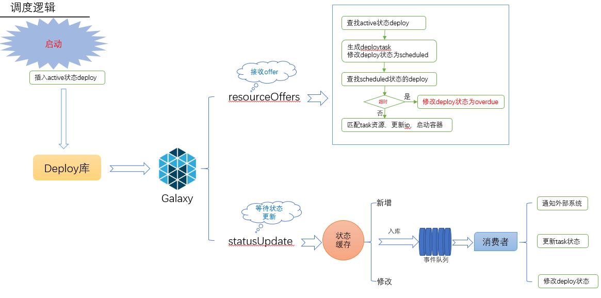
&emsp;&emsp;首先是用户通过api或者界面添加相应的Deploy，我们定义一次发布单元叫Deploy，添加完Deploy之后，就等待mesos框架的调用，这时galaxy会根据一定规则先搜索Deploy库，找出active状态的Deploy，然后和mesos传过来的offer匹配，如果匹配上了就发起调用，否则拒绝offer。当发起完调用之后，galaxy就要等着更新task的状态，只有一个Deploy的所有task都启动完了，这个Deploy才算完成了调度，否则就算超时或失败。这里面涉及到几个状态的更新，还有事务。
#### Galaxy界面
&emsp;&emsp;目前处于最小可用版本，优先保证稳定性。整个操作简单易用，界面风格如下：
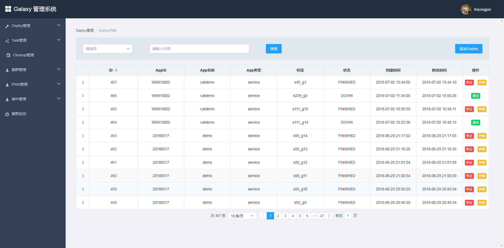
&emsp;&emsp;用户可以在主界面查看现有的Deploy列表和状态，也能激活和停止Deploy，还能扩容缩容Deploy。如果要添加Deploy，可以通过以下界面：
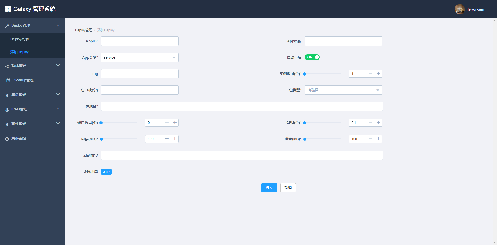
&emsp;&emsp;用户填好相关内容，选择启动的类型，jar包或者image，然后指定相应的网络模型，如果是bridge还要指定相应的端口映射。其它还有一些相关操作就不做具体介绍了，有兴趣的朋友可以留言给我。
#### Galaxy API
&emsp;&emsp;除了使用界面添加Deploy，我们也可以通过API来发起调用。以下是添加Deploy的API：

```java
POST /api/deploy
{
  "appId": "string",
  "appName": "string",
  "appType": "string",
  "cmd": "string",
  "cpus": 0,
  "disk": 0,
  "dockerParametes": {},
  "envMap": {},
  "forcePullImage": true,
  "instances": 0,
  "keepAlive": true,
  "memory": 0,
  "networkType": "string",
  "packageId": "string",
  "packageType": "string",
  "packageUri": "string",
  "portMappings": [
    {
      "containerPort": 0,
      "hostPortIndex": 0,
      "protocol": "string"
    }
  ],
  "ports": 0,
  "privileged": true,
  "tag": "string",
  "volumes": [
    {
      "containerPath": "string",
      "hostPath": "string",
      "mode": "string"
    }
  ]
}
```
&emsp;&emsp;相关其它API还有很多，可以通过swagger ui查看，下图是通过swagger界面查看的相关Deploy的全部API：
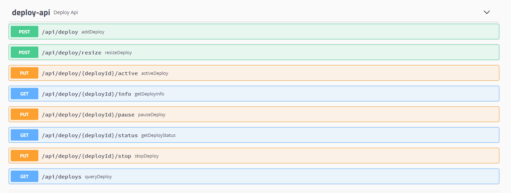
#### 容器监控
&emsp;&emsp;容器监控有很多方案，我们采用的telegraf+grafana+karisdb做的，我也调研了Prometheus的相关方案。目前监控界面如下：
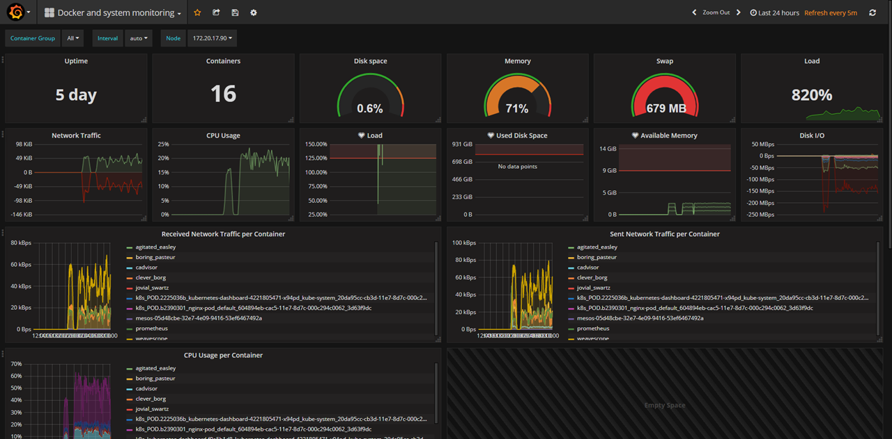

## 结束语
&emsp;&emsp;Galaxy容器调度系统就介绍到这，从事情经过的来龙去脉到原理架构，以及Galaxy的相关设计，整体脉络我是介绍清楚了，里面的一些细节就不做过多阐述了。去年大半年的时间都在做这些事情，虽然是工作以来最累的，但是收获确实很大。不仅仅是扩展了技术视野和相关技能，也扩展了跨系统解耦相关的一些经验，如何确定系统边界，如何系统交互更好，第一次体会到这种挑战。同时也积累了一些问题，主要管理方面的问题，都强调领导力，其实有时候还真得靠原则强压，领导指望下面的人跳出来，下面的人又一个比一个牛逼，这个时候就需要领导协调，因为只有你看得更远，这样争论来争论去，中国人难免会有小疙瘩。我是见过了见怪不怪，后面发现太浪费时间了，我也就只有私下建议，不在争论了，因为有些事情不一定非得那样走不可，而有些人自己不承担责任非要别人按照他的意愿走。通过经历这些事情也识别了一些比较靠谱的同事，也识别了一些人不坏但是不切实际的同事，为以后转管理方向积累了不少经验值。
