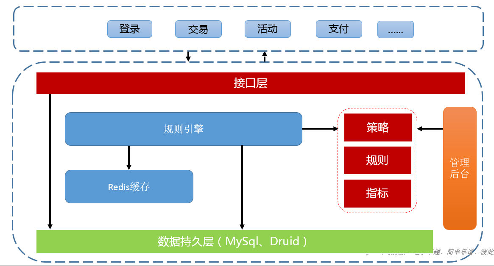
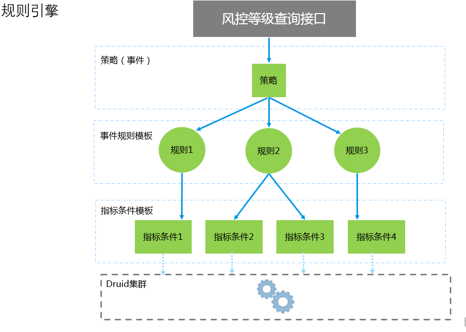
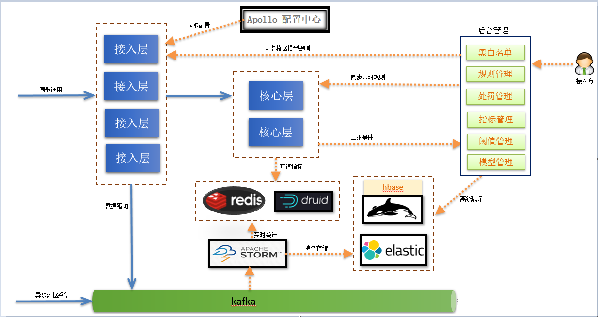
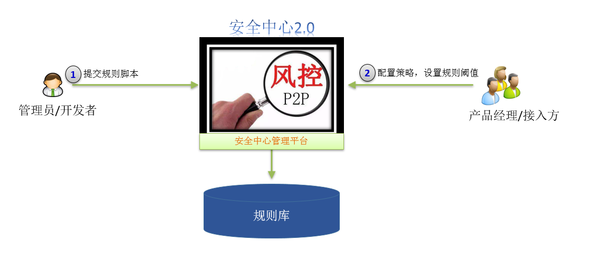
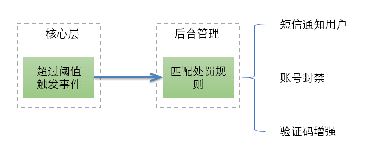

&emsp;&emsp;转岗到平研创新Team一直在忙于风险系统的优化升级。上一次聊到对系统问题如何解决的方法论，这次碰到的就是这类问题，因为不是简单的线性问题，所以不能通过优化一个单点解决问题。今天就聊聊这一个多月忙的事情。
&emsp;&emsp;当前互联网企业存在很多风险，特别是金融行业，一直被羊毛党，刷单党光顾。比如像一些账号问题，由于用户的使用习惯，会在各个站点注册账号使用相同的用户名和密码，这就给了黑产份子可乘之机。他们会找相对比较小安全防护不严的网站利用SQL注入或者其他漏洞进行拖库，获取用户的账号信息，然后对密码进行清洗，俗称洗库，最后拿到用户登录账号明文信息到一些知名网站去试，俗称撞库，这有可能对用户造成损失。
&emsp;&emsp;由于以上一些问题的存在，要面对互联网上的实时攻击。风控系统需要解决如下问题：
- 哪些业务是有风险的，注册、登录、交易、活动等等，这需要业务方埋点传入合适的参数。
- 什么事件是有风险的，这需要用到统计学，对异常用户的历史数据做统计分析，找出异于正常用户的特征。
- 实时性，而且对风险事件必须是毫秒级的响应，有些场景需要尽快拦截，及时给用户挽回损失。
- 低误报，需要人工风控经验，对各种场景的风险阈值和评分设置，需要长期不断的调整。
- 支持对历史数据的回溯，能够发现以前的未发现的风险，对现有的策略设定提供参考。
&emsp;&emsp;公司现有的风控系统架构如下所示：

&emsp;&emsp;整个系统是一个单体结构，外部系统直接通过接口调用得到实时的风险等级标识，然后业务系统根据风险等级标识采取相应的措施，比如验证码或者拒绝阻塞。接口需要传入策略名称，策略是规则引擎定义的模型对应一组规则，每个规则都对应一组指标，策略、规则和指标关系如下图所示：

&emsp;&emsp;可以把策略理解成规则集合，策略是最终判别风险的依据。系统根据所有规则的分值汇总得到总和，总和越大说明风险等级越高。规则就是需要执行的脚本逻辑，会查询指标然后和阈值比对，如果大于阈值就返回相应的分值。对业务方而言只需要关心策略配置和阈值等级设定，脚本逻辑不需要关心。脚本逻辑是应对各种场景的关键，里面有一些逻辑处理，需要查询存储数据库查找对应指标值和历史数据。
&emsp;&emsp;业务方在接入时首先传入策略名称，这是风控系统定位规则集合的唯一标识，拿到规则集合后会执行相应的规则脚本，然后汇总分值，再根据业务方在后台系统配置的等级规则设定相应的等级，最后返回给业务方，业务方拿到风险等级后再去做一些处理。整个过程不是很复杂，但是因为是单体结构，很多代码逻辑耦合在一起，难于维护而且也不好改进。因为一旦涉及到改动就会影响原有逻辑，总结一下目前系统架构有如下不足：
- 只有统计规则和静态规则，像一些行为规则和关联规则支持不了。
- 规则阈值和风险等级的设定没有客观评价指标。
- 系统功能耦合在一起，数据采集、限流和指标计算都在一个接口中。
- 没有充分利用缓存，仅仅把缓存当配置中心使用。
- 接入场景单一，只支持同步接入同步处理风险。
&emsp;&emsp;以上是目前系统痛点，更关键的是如果单纯的从系统层面优化没有多大意义。因为对业务方来说是想要需要知道策略的实际效果，进行风险识别时是否影响到了用户体验，是否预防到了真正风险，这些都没有一个离线分析的指标做参考。所以下图所示的一个反馈闭环很重要：

&emsp;&emsp;一般来说业务方在接入风控系统时需要先配置策略规则，然后设定每个规则对应的阈值和分值等级，完了就可以应用上线观测实际预测的效果，实际的预测结果只能依赖离线分析，可能需要对用户历史操作轨迹进行分析，如果预测结果拦截的都是正常操作的用户，这时可能就需要调整阈值。有了这个闭环就知道接下来需要做的事情了，后面所有的架构都是围绕这个闭环来进行。经过重新梳理后架构图如下：

&emsp;&emsp;新架构对原有逻辑功能进行了拆分。接入层主要是进行数据格式检查和信息丰富，比如ip地址可能需要转化为地区城市，浏览器类型需要打标识，然后将数据落地写入kafka，以便接下来的离线分析和回溯。核心层就是规则同步和策略匹配，这块是比较核心的东西，会随着业务变化架构层面不直接对接业务，所以下沉在接入层后面，接入层对外是不可变的。数据落地后有实时Job进行一些指标分析入库，这样用户在设定指标阈值时可以根据历史数据参考，比如同一个ip最近7天登录次数，这个次数阈值可以基于历史用户来设定，这样业务方在设定阈值时也有一个预期大概会拦截多少用户，多少用户会受影响。接入方式可以有同步和异步，同步需要实时响应用户告诉用户风险等级。异步就是用户发来数据就完事了，后台的实时job会读取kafka的数据利用CEP模型的esper框架进行风险预测然后采取相应的动作。
&emsp;&emsp;在功能层面也会更丰富一些，老的架构是直接写入druid，指标分析是去查druid的数据做实时汇总统计。这样做有好处就是实现简单，但是性能随着接入方增多会下降，如果能事先把一些指标计算好，使用时直接来查不用做实时计算性能会提升很大。同时加强了后台管理的能力，用户和管理员各自关注不同领域。

&emsp;&emsp;开发者也就是管理员会根据业务需求编写规则脚本，然后业务方再配置这些规则脚本的阈值和分值。规则方面可以支持四种：

- 静态规则
基于某个静态值的限制性规则，比如三元验证一致、是否命中黑名单、常用联系人验证、电信服务使用地理范围验证等
- 统计规则
用统计计算的值来作为验证的条件，如来自某个设备或者IP的申请次数大于某个值
- 关联规则
指用户在进行了某个操作之后，又执行另外一个操作，带来的风险。例如，修改账号密码后，进行交易操作
- 行为规则
指用户的异常行为，例如用户在常驻地址或者某个特殊的时间如深夜，进行了交易操作，一般也认为具备一定的风险

&emsp;&emsp;风控系统实际是包含两部分内容，一是识别风险，二是对识别后的风险或是自动的或是人工的进行处理。后台系统增加了惩罚管理，相对于原先风险处理硬编码在业务逻辑中，惩罚管理可以做到可配置化的分级处理，当然响应可能没有以前及时，但是也是近实时的。整体流程如下所示。

&emsp;&emsp;以上就是最近一段时间梳理的风控系统架构。目前只是对原有的逻辑进行拆分，为后期离线分析打下基础。后期会利用elasticsearch做一个超级cube的指标系统，参考平安spark+hive+es的方案，对用户历史行为轨迹做不同维度的分析。让业务方对用户更了解，逐步形成数据驱动风险策略的设定。
