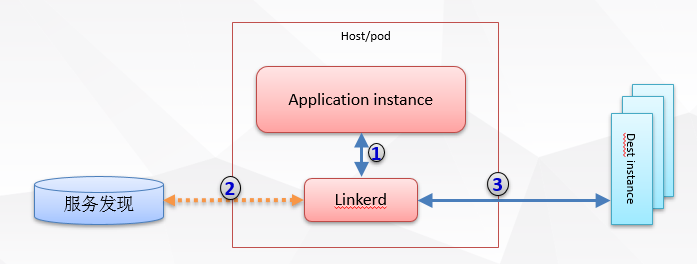
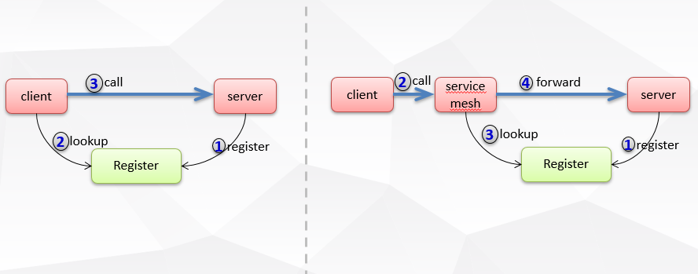
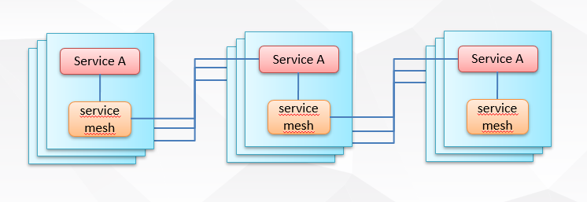
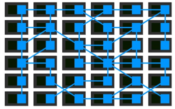
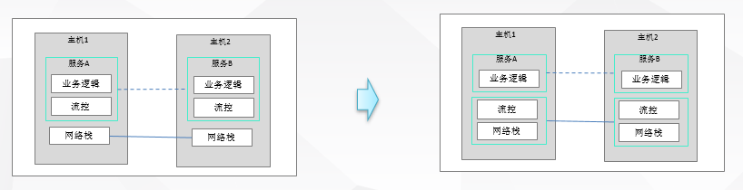
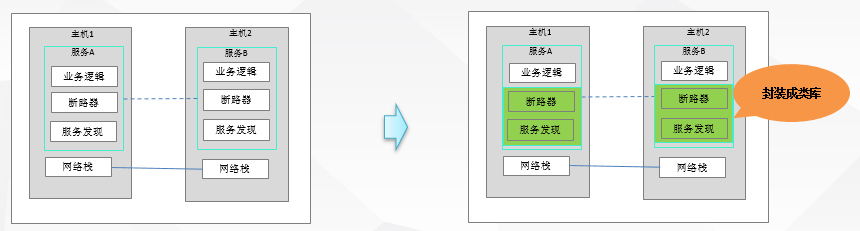
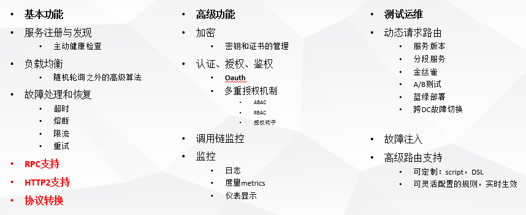
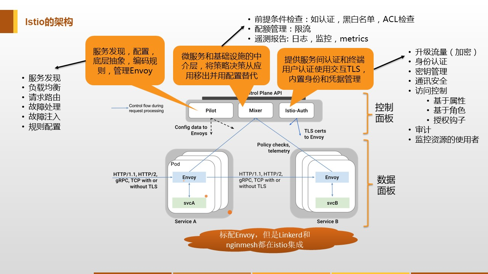

## 前言
&emsp;&emsp;前段时间前老大发了一篇文章说不看好servicemesh，我个人不是很赞同这个观点。哲学上有句话说不是我们的认知能力要如实的反映认知对象，而是认知对象要符合我们的认知能力。观点的不同取决于你看问题的视角，没有孰是孰非。来公司也有一年多快两年时间了，过去一直在做微服务体系架构方面的工作。微服务也是近几年兴起的一门新技术，我首次接触微服务还是在携程的时候。2014年微服务处于萌芽期，2015年成为热点，2016年基本普及了。现在传统企业慢慢转向微服务技术栈也是大势所趋，直到最近2017年初出现了对微服务的反思，从而产生了新一代微服务技术ServiceMesh。今天就从个人视角聊聊ServiceMesh的产品思路究竟有何可取之处。谈一件事仅从一个孤立的事件是没法说清问题的，得通过趋势放大时间维度才能看清。

## 正文
### 什么是ServiceMesh
&emsp;&emsp;这是一个新词最早由开发Linkerd的Buoyant公司提出，2016年9月第一次公开使用这个术语。在2017年初的随着Linkerd的传入，ServiceMesh才开始进入国内技术圈的视野，最早被翻译为“服务啮合层”，由于比较拗口之后改成了“服务网格”。
&emsp;&emsp;那到底什么是ServiceMesh呢？Linkerd的CEO William是这样定义的：
> 服务网格是一个基础设施层，功能在于处理服务间通信，职责是负责实现请求的可靠传递。在实践中，服务网格通常实现为轻量级网络代理，通常与应用程序部署在一起，但是对应用程序透明。

&emsp;&emsp;单纯的文字太抽象，还是通过下图来说明一下：

&emsp;&emsp;从上图的部署模型上看，对于单个请求而言，作为请求发起者的客户端实例会首先采用简单方式将请求发送到本地的ServiceMesh实例上，客户端应用实例和ServiceMesh实例是两个独立的进程，他们之间的调用是远程调用。ServiceMesh会把客户端请求路由到目标服务，这时的ServiceMesh承担着服务发现和负载均衡的角色，就像一个边车sidecar。我们来看它和传统微服务调用有什么不同？

&emsp;&emsp;初看ServiceMesh好像就是在客户端和服务端之间多加了层代理而已，也不是什么新的东西。这是仅从单个服务之间调用的视角看，如果从多个服务调用视角看：

&emsp;&emsp;多个服务调用的情况，从上图我们可以看到ServiceMesh在所有服务的下面，这一层被称为服务间通讯专用基础设施层。ServiceMesh会接管整个网络，把所有请求在服务之间做转发。这样上面的服务就不在担负传递请求的具体逻辑了，只专注完成业务逻辑，服务之间的通讯环节就从应用层剥离出来，呈现一个抽象层。如果有大量的服务，就会表现出如下所示的网格来，这时候代理体现出来就和前面的有点不一样了，而是形成一个网状结构。

&emsp;&emsp;总结一下，服务网格实际上是抽象出了一个基础设施层，独立于应用之外，所提供的功能就是实现请求的可靠路由，部署上体现为轻量级的网络代理，并对应用是透明的。

### ServiceMesh的演化过程
&emsp;&emsp;在第一代网络计算机系统时代，那时的程序猿需要在自己的代码中添加网络通讯的细节问题，例如数据包顺序，流控等等，导致网络逻辑和业务逻辑混杂在一起。后来为了改进这一问题才出现了TCP/IP技术，解决了流控和数据包顺序问题，从下图可以看出，网络最重要的流控逻辑已经从应用逻辑中剥离开了，剥离出来的东西成了操作系统网络层的一部分。

&emsp;&emsp;自从有了TCP/IP技术，写代码再也不用考虑网卡怎么发了，这件事大概发生在五十多年前。虽然不用考虑网卡数据包相关的问题了，但是随着服务数的增多，所面临的挑战也很多，比如服务注册、服务发现、负载均衡等等，这些问题都需要考虑。

&emsp;&emsp;如上图所示，左边的是微服务时代第一版处理问题的方式，业务逻辑和熔断限流服务注册与发现等非业务逻辑混杂在一起。为了简化开发，人们开始把这些和业务无关的逻辑封装成类库，比如典型的Netflix OSS套件。这样开发人员只需要写少量的代码或注解，就能实现这些功能，极大缓解了程序猿们的业务压力。
&emsp;&emsp;但是凡事有利有弊，这样虽然解决了一部分问题，同时也会带来新的问题。Netflix把每个通用的功能封装成一个个基础套件形成了一系列产品，比如像eureka、hystrix、feign、archiaus以及ribbon等等。开发人员是不需要开发非业务相关的代码了，也要花费相当的时间熟悉其中的原理，否则一旦出现问题就没法解决了。对业务团队的人来说，擅长的往往是对业务的理解而不是技术，实现业务是业务开发人员的核心价值，微服务是手段而不是目标。业务开发人员花相当多的精力学习这些和业务无关的框架是得不偿失的。相反比学习微服务框架更大的挑战是微服务拆分、API设计、数据一致性、康威定律。
&emsp;&emsp;微服务时代面临最大的挑战就是服务治理，特别是现在是一个云原生的时代，服务治理就显得尤其关键。但是Netflix OSS套件提供的服务治理功能十分粗糙不够强大。下图列举了一些服务治理常用的功能列表：

&emsp;&emsp;封装成类库带来的另一个问题就是跨语言。微服务在刚开始面世时就承诺了一个很重要的特性：不同微服务可以采用最适合的语言来编写，也就是微服务之间能实现跨语言的调用。如果是用类库的方式来实现，意味着所有的语言你都得实现一遍，提供不同语言的类库版本，要考虑各个语言之间的类型转换等等。还有类库版本兼容问题都要考虑，更加严峻的现实是类库版本升级将是灾难。
&emsp;&emsp;因此基于以上这些情况，我们可以反思一下微服务的问题到底出在哪里？
> 1.上面我们都在谈问题和挑战，好像没有说服务本身。问题的根源就是要解决服务通讯和路由，这才是微服务框架需要解决的问题。
> 2.上面所有的努力都是为了将客户端请求路由到挣钱的地方，比如有版本差异，需不需要做负载均衡，要不要做灰度，最终这些考虑都是为了将请求发送到正确的目的地址。
> 3.服务之间的调用请求，这个请求本身在传递过程中不会发生更改，而且这个请求能被不同的语言框架识别。

&emsp;&emsp;类比以前的TCP/IP协议栈技术，它要解决的问题将请求发送到正确的地方。有了TCP/IP技术，应用开发就不用关心TCP层下的链路实现了。因此为什么现在开发微服务应用时要这么关心服务的通讯层呢？这种情况下自然产生一个想法，是否可以把微服务和通讯相关的下层为网络栈协议，也就是理想状态就是在网络协议层中添加一个微服务应用层来完成整个事情。虽然现在因为标准问题，实现起来不现实，但是不排除未来会出现一个微服务网络层。目前主流的方案在代理的基础上添加完善的治理功能，产生了由所谓数据平面和控制平面构成的ServiceMesh解决方案。目前开源社区里最热门的ServiceMesh产品是Istio。

## 结束语
&emsp;&emsp;到此就介绍完ServiceMesh的演进过程了，虽然目前ServiceMesh方兴未艾，各个开源产品都在持续迭代中，同时也有不少质疑的声音，例如我的前老大，但是我还是非常看好ServiceMesh的发展前景。通过技术栈的下移，确实解决了不少问题。开发人员有了ServiceMesh以后，不用关注那么多插件的使用方式和原理了，只需关注应用本身的业务逻辑，ServiceMesh会把治理功能做强做大，它会解决跨语言跨协议的调用，ServiceMesh如果要升级对应用都是透明无感知的。有了ServiceMesh以后，客户端和服务端都极其简化，客户端只需要向ServiceMesh发出请求即可，会少很多类库依赖，这样减少了jar包冲突的风险，而服务端只要做一件事件就是服务注册。
&emsp;&emsp;ServiceMesh不仅方便了开发人员，对运维管理也将是革命性的变化。如果有了ServiceMesh的治理功能，运维对系统的管理和控制力也会空前强大，很多运维工作都可以通过可视化的控制平面完成。
&emsp;&emsp;ServiceMesh解决跨语言的问题，给许多新兴小众语言也带来利好。对于语言选择来说，最重要的就是生态，由于java语言生态丰富，有很多完善的类库和框架，导致开发java应用会非常快速便捷。因此现在市场上java程序员机会就比其它的多，像我这种原先鄙视java的都不得不从c++转到java上来。有了ServiceMesh以后，小众语言就可以避开这个弊端，不必和java比拼生态，而是发挥各自语言的优势。
&emsp;&emsp;最后放一张Istio的架构图结束全文，让我们全面拥抱新一代微服务ServiceMesh！

