## 前言
&emsp;&emsp;研究生期间的研究方向是数据挖掘，学过一段时间的BP神经网络，为了发表论文硬着头皮推导了三个月的梯度下降算法才从数学原理上搞明白，后来还用c语言实现了一版。也正是因为这段痛苦的经历，后面放弃继续深入研究下去。最近这几年随着TensorFlow热门起来，机器学习发展到深度学习，人工智能越来越热门了，现在不了解点人工智能的东西都不好意思说在IT界混了。由于我以前搞的是机器学习，当时深度学习还没有出来。最近我也一直断断续续的在学习这块，这次就浅浅的聊一下深度学习，把里面一些公司推导都去掉，让大家明白深度学习是什么，要解决什么问题，各有什么优缺点等等。、

## 正文
&emsp;&emsp;20世纪80年代末期，人工神经网络的反向传播算法（也叫Back Propagation算法或者BP算法）的发明，给机器学习带来了希望，掀起了基于统计模型的机器学习热潮。神经网络如下图所示：
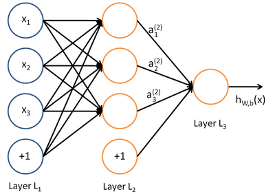
&emsp;&emsp;上图中每个圆圈都是一个神经元，每条线表示神经元之间的连接。可以看到，神经元被分了多层，层与层之间的神经元有连接，而层内之间的神经元没有连接。最左边的是输入层，负责接收输入数据。最右边是输出层，负责输出最终结果。输入层和输出层之间的层叫做隐藏层。
&emsp;&emsp;隐藏层大于2层的神经网络叫做深度神经网络，而*深度学习*就是使用深层架构（比如，深度神经网络）的机器学习方法。深层网络和浅层网络相比，深层网络表达力更强。事实上，一个仅有一个隐藏层的神经网络能拟合任何一个函数，但是有一个缺点就是浅层网络需要更多的神经元。而深层网络可以用少的多的神经元拟合同样的函数，不过深层网络也有缺点，就是它不太容易训练收敛。简单的说，就是训练好一个深层神经网络往往需要大量的数据和技巧。
&emsp;&emsp;从上图中可以看到，构成神经网络的基本单位就是一个个神经元，那什么是神经元呢？神经元也叫感知器，在上个世纪50-70年代很流行，也解决过很多实际的问题，并且感知器的算法也很简单，请看下图：
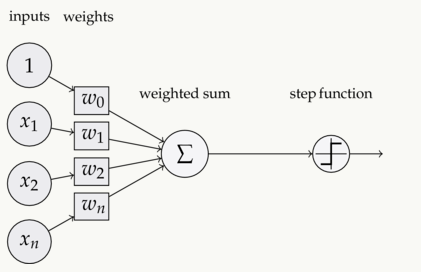
&emsp;&emsp;可以看到，一个感知器有如下组成部分：
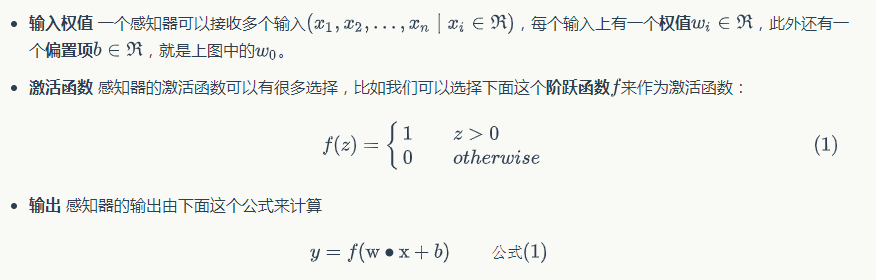
&emsp;&emsp;了解了神经网络的结构，那么如何训练神经网络呢？训练神经网络实际上就是参数W取什么值最优。一般来说，根据训练样本的不同可以分为两类机器学习方法。
> * 监督学习：这种训练方法要求提供的训练样本既要包含输入特征X，也要包含对应的输出Y。比如我们知道一些人的工作年限，工作职级，所在行业，也知道他们对应的收入。我们就可以用这样的样本去训练模型，让模型既看到我们提出的问题（输入特征x），也看到对应问题的答案（标记y）。当模型看到足够多的样本后，它就能总结出其中的规律，然后就可以预测那些它没有看过的输入所对应的答案了。

> * 无监督学习：这种训练方法要求提供的样本可以只有x没有y。模型可以总结出特征x的一些规律，但是无法知道其对应的答案。这种方法一般用在聚类分析上，比如语音识别领域，先让模型总结出那些音节是相似的，然后再用少量带有标注的训练样本，告诉模型其中一些音节对应的文字，这样模型就能把相似音节都对应到相应文字上，从而完成模型的训练。

&emsp;&emsp;先只考虑监督学习，在监督学习下，对于一个样本，我们知道它的特征x，以及标记y。同时，我们还可以根据模型h(x)计算得到输出y'。注意这里面我们用表示训练样本里面的标记，也就是实际值；用带上'的表示模型计算的出来的预测值。模型计算出来的预测值和实际值越接近越好。最后问题就演变成求所有单个样本误差总和的最小值，如果能找到一组W能满足这个目标，那就是模型的最终结果。
&emsp;&emsp;大学时我们学过怎样求函数的极值。函数的极值点，就是它的导数的那个点。因此我们可以通过解方程，求得函数的极值点。不过对于计算机来说，它可不会解方程。但是它可以凭借强大的计算能力，一步一步的去把函数的极值点『试』出来。如下图所示：
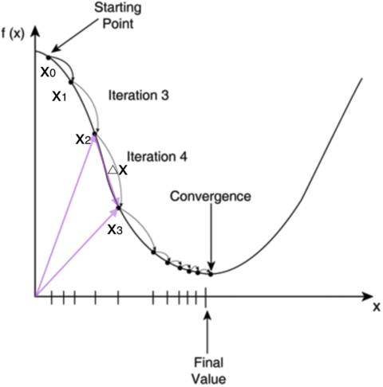
&emsp;&emsp;首先随便选择一个点开始，比如上图x0的点。接下来，每次迭代修改x的为x1,x2,x3,...，经过数次迭代后最终达到函数最小值点。现在的问题关键是如何修改x，保证能往函数最小值那个方向前进？这里就用上大学学到的梯度概念了，翻开大学高数课的课本，我们会发现梯度是一个向量，它指向函数值上升最快的方向。显然，梯度的反方向当然就是函数值下降最快的方向了。我们每次沿着梯度相反方向去修改的值，当然就能走到函数的最小值附近。之所以是最小值附近而不是最小值那个点，是因为我们每次移动的步长不会那么恰到好处，有可能最后一次迭代走远了越过了最小值那个点。步长的选择是门手艺，如果选择小了，那么就会迭代很多轮才能走到最小值附近；如果选择大了，那可能就会越过最小值很远，收敛不到一个好的点上。

&emsp;&emsp;现在，我们需要知道一个神经网络的每个连接上的权值是如何得到的。我们可以说神经网络是一个模型，那么这些权值就是模型的参数，也就是模型要学习的东西。然而，一个神经网络的连接方式、网络的层数、每层的节点数这些参数，则不是学习出来的，而是人为事先设置的。对于这些人为设置的参数，我们称之为超参数(Hyper-Parameters)。这些超参数的不同，则对应不同的模型，下面介绍几种常见的网络模型：
### 全连接神经网络
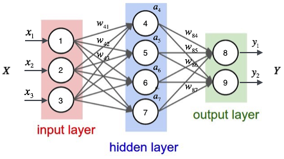
&emsp;&emsp;这种网络在使用反向传播算法进行梯度计算时，可能导致梯度消失的问题。不太适合图形识别这样的应用领域，原因主要是以下几个：
> *参数数量太多* 可以考虑输入1000*1000像素的图片，输入层得有1000x1000=100万节点。如果只有一个100个节点的隐藏层，那么隐藏层就需要（1000x1000+1）x100 = 1亿参数，这实在太大了，因此扩展性非常差。

> *没有利用像素之间的位置信息* 对于图像识别任务来说，每个像素和其周围像素的联系是比较紧密的，和离得较远的像素联系可能就小的多。如果一个神经元和上一层所有的神经元相连，那么就相当于对于一个像素来说，把图像的所有像素都同等对待了，这不符合前面的要求。每次学习完连接权重后，最终可能发现很多权重的值很小，努力学习不重要的权重，这样的学习效率非常低。

> *网络层数限制* 网络层数越多其表达能力越强，同时通过梯度下降算法达到权重收敛的难度也会越来越大，因为全连接神经网络的梯度很难传递超过3层。

### 卷积神经网络
&emsp;&emsp;由于全连接网络的诸多缺点，后来的计算机科学家想了很多办法解决这些问题，归纳下来主要有三个思路：
> *局部连接* 每个神经元不再和上一层的所有神经元相连，只和一部分神经元相连，这样就减少了很多参数。
> *权值共享* 一组连接可以共享同一权重，而不是每个连接都有不同权重，这样也减少了很多参数。
> *下采样* 使用Pooling（取最大值，最小值，平均值）来减少每层的样本数，进一步减少参数数量，同时还可以提升模型的鲁棒性。

&emsp;&emsp;下图就是一个典型的卷积神经网络：
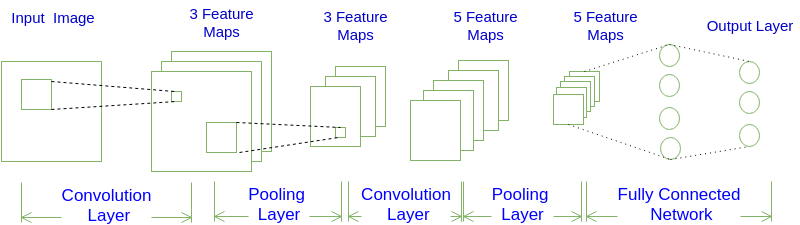
&emsp;&emsp;一个卷积神经网络由若干卷积层、Pooling层、全连接层组成。你可以构建各种不同的卷积神经网络，它的常用架构模式为N个卷积层叠加，然后(可选)叠加一个Pooling层，重复这个结构M次，最后叠加K个全连接层。

&emsp;&emsp;从图中可以发现卷积神经网络的层结构和全连接神经网络的层结构有很大不同。全连接神经网络每层的神经元是按照一维排列的，也就是排成一条线的样子；而卷积神经网络每层的神经元是按照三维排列的，也就是排成一个长方体的样子，有宽度、高度和深度。
&emsp;&emsp;对于图中展示的神经网络，我们看到输入层的宽度和高度对应于输入图像的宽度和高度，而它的深度为1。接着，第一个卷积层对这幅图像进行了卷积操作(后面我们会讲如何计算卷积)，得到了三个Feature Map。这里的"3"可能是让很多初学者迷惑的地方，实际上，就是这个卷积层包含三个Filter，也就是三套参数，每个Filter都可以把原始输入图像卷积得到一个Feature Map，三个Filter就可以得到三个Feature Map。至于一个卷积层可以有多少个Filter，那是可以自由设定的。也就是说，卷积层的Filter个数也是一个超参数。我们可以把Feature Map可以看做是通过卷积变换提取到的图像特征，三个Filter就对原始图像提取出三组不同的特征，也就是得到了三个Feature Map，也称做三个通道(channel)。
&emsp;&emsp;继续观察图，在第一个卷积层之后，Pooling层对三个Feature Map做了下采样(后面我们会讲如何计算下采样)，得到了三个更小的Feature Map。接着，是第二个卷积层，它有5个Filter。每个Fitler都把前面下采样之后的3个**Feature Map卷积在一起，得到一个新的Feature Map。这样，5个Filter就得到了5个Feature Map。接着，是第二个Pooling，继续对5个Feature Map进行下采样**，得到了5个更小的Feature Map。
&emsp;&emsp;下图就是很形象的展示了这一计算过程：

### 循环神经网络
&emsp;&emsp;通过介绍前面两种模型，可以发现不管哪种模型都往往只能解决某一类问题，不能解决所有问题。这也是很多深度学习门外汉不了解的。前面两种网络模型，他们都只能单独的去处理一个个的输入，前一个输入和后一个输入完全没有关系。但是，现实中往往有些任务之间是有关系的，比如当我们在理解一句话意思时，孤立的理解这句话的每个词是不够的，我们需要处理这些词连接起来的整个序列；当我们处理视频的时候，我们也不能只单独的去分析每一帧，而要分析这些帧连接起来的整个序列。这时，就需要用到深度学习领域中另一类非常重要神经网络：循环神经网络(Recurrent Neural Network)。RNN种类很多，也比较绕脑子。
&emsp;&emsp;下图是一个简单的循环神经网络如，它由输入层、一个隐藏层和一个输出层组成：
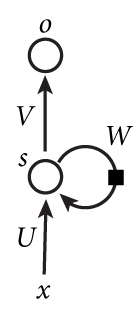
&emsp;&emsp;循环神经网络比较抽象，难以图示表达。单纯从上图看，如果去掉W哪个带箭头的圈，它就变成一个普通的全连接神经网络了。那多出来的W是什么呢？循环神经网络的隐藏层的值s不仅仅取决于当前这次的输入x，还取决于上一次隐藏层的值s。权重矩阵 W就是隐藏层上一次的值作为这一次的输入的权重。
&emsp;&emsp;如果我们把上面的图展开，循环神经网络也可以画成下面这个样子：
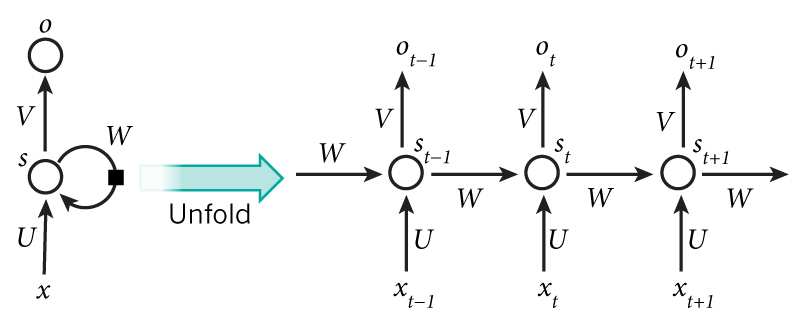
&emsp;&emsp;现在看上去就比较清楚了，这个网络在t时刻接收到输入Xt之后，隐藏层的值是St，输出值是Ot。关键一点是，St的值不仅仅取决于Xt，还取决于St-1。
&emsp;&emsp;对于语言模型来说，很多时候不仅要看前面的输入，也要看后面的输入，比如下面这句话：
我的手机坏了，我打算____一部新手机。
&emsp;&emsp;可以想象，如果我们只看横线前面的词，手机坏了，那么我是打算修一修？换一部新的？还是大哭一场？这些都是无法确定的。但如果我们也看到了横线后面的词是『一部新手机』，那么，横线上的词填『买』的概率就大得多了。
&emsp;&emsp;上图中的基本循环神经网络是无法对此进行建模的，这时就需要另外一种双向循环神经网络模型了，如下图所示：
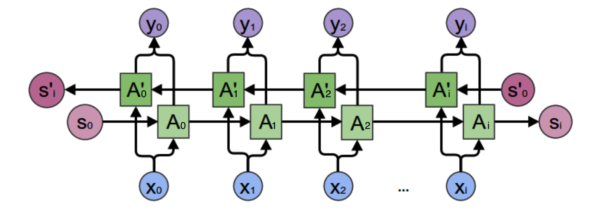
&emsp;&emsp;循环神经网络在训练中很容易发生梯度爆炸和梯度消失，这导致训练时梯度不能在较长序列中一直传递下去，从而使得模型无法捕捉到长距离的影响。为了解决这些问题，后来科学家发明了一种改进之后的循环神经网络：长短时记忆网络(Long Short Term Memory Network, LSTM)，它成功的解决了原始循环神经网络的缺陷，成为当前最流行的RNN，在语音识别、图片描述、自然语言处理等许多领域中成功应用。但不幸的一面是，LSTM的结构很复杂。
&emsp;&emsp;LSTM的思路比较简单。原始RNN的隐藏层只有一个状态，即h，它对于短期的输入非常敏感。如果增加一个状态C，来保存长期状态，就解决问题了。LSTM的关键，就是怎样控制长期状态c。在这里，LSTM的思路是使用三个控制开关。第一个开关，负责控制继续保存长期状态c；第二个开关，负责控制把即时状态输入到长期状态c；第三个开关，负责控制是否把长期状态c作为当前的LSTM的输出。三个开关的作用如下图所示：
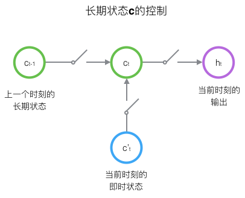

### 递归神经网络
&emsp;&emsp;循环神经网络可以用来处理包含序列结构的信息。除此之外，信息往往还存在着诸如树结构、图结构等更复杂的结构。对于这种复杂的结构，循环神经网络就无能为力了。
&emsp;&emsp;神经网络的输入层单元个数是固定的，因此必须用循环或者递归的方式来处理长度可变的输入。循环神经网络实现了前者，通过将长度不定的输入分割为等长度的小块，然后再依次的输入到网络中，从而实现了神经网络对变长输入的处理。一个典型的例子是，当我们处理一句话的时候，我们可以把一句话看作是词组成的序列，然后，每次向循环神经网络输入一个词，如此循环直至整句话输入完毕，循环神经网络将产生对应的输出。
&emsp;&emsp;然而，有时候把句子看做是词的序列是不够的，比如下面这句话：
『两个外语学院的学生』
&emsp;&emsp;不同的语法解析树则对应了不同的意思。一个是『两个外语学院的/学生』，也就是学生可能有许多，但他们来自于两所外语学校；另一个是『两个/外语学院的学生』，也就是只有两个学生，他们是外语学院的。为了能够让模型区分出两个不同的意思，我们的模型必须能够按照树结构去处理信息，而不是序列，这就是递归神经网络的作用。当面对按照树/图结构处理信息更有效的任务时，递归神经网络通常都会获得不错的结果。
&emsp;&emsp;递归神经网络可以把一个树/图结构信息编码为一个向量，也就是把信息映射到一个语义向量空间中。这个语义向量空间满足某类性质，比如语义相似的向量距离更近。也就是说，如果两句话（尽管内容不同）它的意思是相似的，那么把它们分别编码后的两个向量的距离也相近；反之，如果两句话的意思截然不同，那么编码后向量的距离则很远。如下图所示：
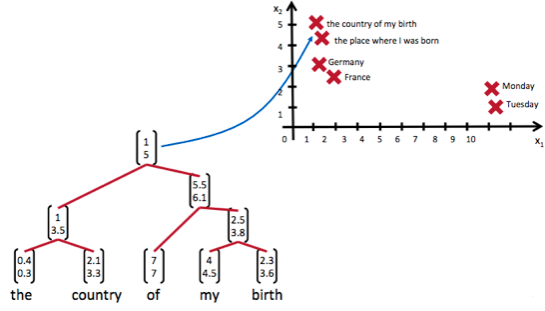

## 结尾
&emsp;&emsp;深度学习相关东西就聊到这。去掉很多繁琐的数学原理推导，如果通过这篇文章能明白深度学习是什么，各个模型分别有什么优缺点，各自都解决什么问题，达到这几点就算入门了深度学习，跟上IT技术的发展了。
