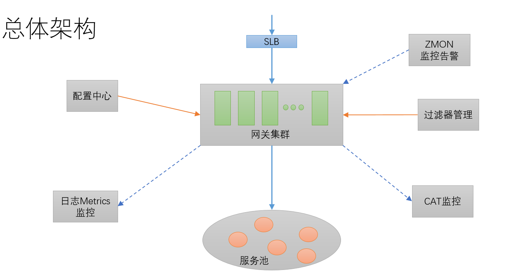
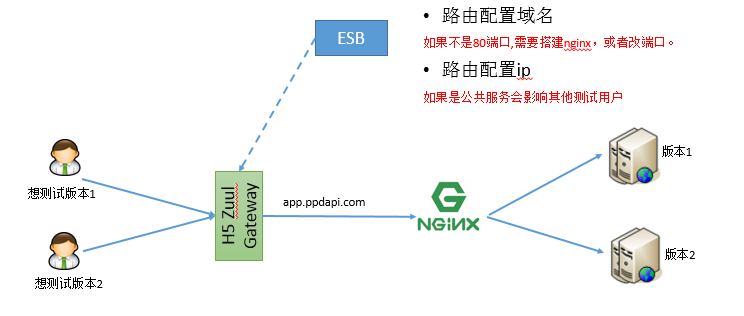
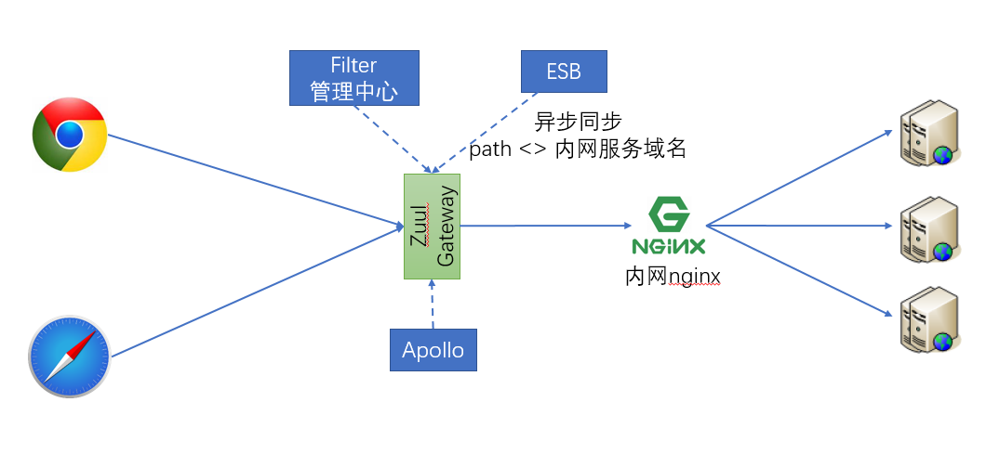
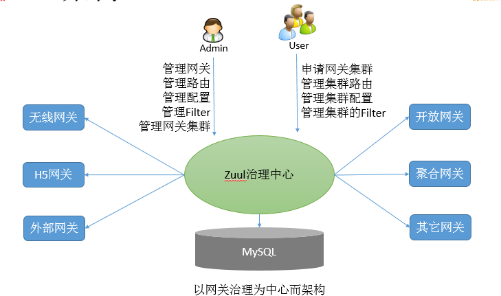
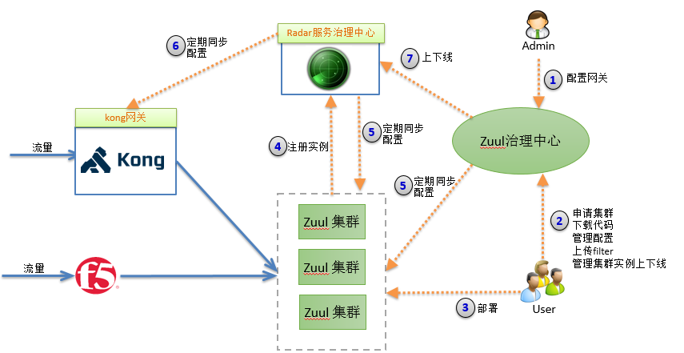

## 前言
&emsp;&emsp;过去一年多时间，我负责公司目前三套网关（无线网关、H5网关、第三方网关）的架构研发工作。参考Netflix开源的zuul定制化了一套基于异步servlet机制的网关系统，经过一年多线上流量冲击的考验，目前这套机制运行比较稳定可靠。今天从个人角度聊聊对网关的理解，以及实践过程中所遇到的一些问题和解决方案。

## 正文
&emsp;&emsp;在开始之前，先了解一下下面两个问题：
### 什么是服务网关？
服务网关 = 路由转发 + 过滤器

1、路由转发：接收一切外界请求，转发到后端的微服务上去；

2、过滤器：在服务网关中可以完成一系列的横切功能，例如权限校验、限流以及监控等，这些都可以通过过滤器完成（其实路由转发也是通过过滤器实现的）。

### 为什么需要服务网关？

上述所说的横切功能（以权限校验为例）可以写在三个位置：

1、每个服务自己实现一遍
2、写到一个公共的服务中，然后其他所有服务都依赖这个服务
3、写到服务网关的前置过滤器中，所有请求过来进行权限校验
&emsp;&emsp;显然第一种方式太过臃肿，并不符合工程化的架构理念。第二种相较于第一种就好很多，代码开发不会冗余，但是有两个缺点。由于每个服务引入了这个公共服务，那么相当于在每个服务中都引入了相同的权限校验的代码，使得每个服务的jar包大小无故增加了一些，尤其是对于使用docker镜像进行部署的场景，jar越小越好；由于每个服务都引入了这个公共服务，那么我们后续升级这个服务可能就比较困难，而且公共服务的功能越多，升级就越难，而且假设我们改变了公共服务中的权限校验的方式，想让所有的服务都去使用新的权限校验方式，我们就需要将之前所有的服务都重新引包，编译部署。
&emsp;&emsp;而服务网关恰好可以解决这样的问题。将权限校验的逻辑写在网关的过滤器中，后端服务不需要关注权限校验的代码，所以服务的jar包中也不会引入权限校验的逻辑，不会增加jar包大小；如果想修改权限校验的逻辑，只需要修改网关中的权限校验过滤器即可，而不需要升级所有已存在的微服务。
&emsp;&emsp;当然上面只是从横切面一个方面谈到了需要网关的必要性，实际上网关要做的事情远不止这一个，一个典型的网关系统必须包含以下几个基本功能：
智能路由：服务发现和路由寻址，将外部请求转发到后端服务。
权限校验：检验外部访问的合法性。
API监控：可以监控后端服务的一些性能指标和业务指标，比如响应时间，调用次数，出错比例等等。对异常服务提前做一些告警处理，比如熔断机制。
限流容错：与监控配合，进行限流和容错操作，保护后端服务不会受到异常飙升的流量崩溃。
A|B测试：A|B测试时一块比较大的东西，包含后台实验配置、数据埋点（看转化率）以及分流引擎，在服务网关中，可以实现分流引擎。
&emsp;&emsp;随着微服务成为业界互联网的趋势，网关已经成为重要的基础设施，它可以做到不将服务直接暴露给外部访问，屏蔽了一些安全和服务升级发布所带来的风险，这些也都是网关比较关键的核心功能。
### 网关整体架构
&emsp;&emsp;开源的zuul网关采用的是同步servlet机制，我们采用的是异步servlet机制，这种方式可以提高网关响应的请求数。这套机制在携程也运行良好，我们只不过是直接拿来，结合Cat做了一些监控告警定制，替换现有的.Net网关，比.Net网关多了熔断监控告警，而且zuul采用groovy脚本处理相关逻辑，可以做到动态修改和热部署，将变更风险降到了最低。架构图如下所示：

&emsp;&emsp;整个架构还是比较清晰，流量从外网过来先经过软负载nginx，然后转发到网关集群，网关再根据一定的路由规则将流量转到特定的服务上。网关会对接配置中心，管理路由服务的动态配置信息，比如超时、并发量，连接池大小等相关信息，还会对接elk，把一些出错请求的header头写入日志系统，方便故障定位。

### 存在的问题
&emsp;&emsp;这套网关系统现在线上也还是这样，没有出现重大问题。问题主要集中在测试和日常维护中，可以说占据了大量的精力，这些事情做了不算功劳，但是不做又会影响测试体验，经常会收到一些抱怨。

1、安装部署
&emsp;&emsp;目前我们将网关代码的打成一个war包部署在tomcat中，如果tomcat的版本不一致会带来jar冲突。前期没有考虑到会有多套网关问题，默认将脚本放在指定目录，如果安装多套网关会有脚本冲突问题，而且由于linux和Windows的目录规则还不一样，导致每次部署都要修改配置文件中的目录配置。实际上测试人员并不关心这些问题，他们需要的是网关服务。加上还要制定一些环境参数，比如网关名称，远程配置url地址等等。这些都会给测试人员带来麻烦。

2、配置问题
&emsp;&emsp;配置问题主要是两类配置：一个路由配置，一个是参数配置。路由配置主要是新服务上线，需要通过网关对外提供访问，根据路由规则配置路线信息，比如是否需要验证token或者验签。参数配置主要是配置一些连接池，并发超时等相关信息。两类配置会极大消耗网关维护人员的精力。而且这些配置还不能开放给测试人员，需要对网关机制有比较深入的了解。

3、测试问题
&emsp;&emsp;这类问题是比较多也比较头痛的。先看下面一张图的场景：

&emsp;&emsp;网关定期拉取esb的路由配置信息实现服务发现，网关到后端的调用是通过域名的方式访问。由于只有生产环境做了域名解析，开发测试本地联调时会配置本地host，而且host配置还比较多，必须配置所有访问的域名host。如果两个测试人员都在测试，而且是测试同一个应用的不同版本，由于网关没有做版本路由，所以测试人员还不能使用同一个网关来测试，必须每个测试都搭建自己的网关，这样大家就可以独立的修改自己本地host，互不影响。这种host配置方式还会带来另一个问题，就是一旦服务地址发生变更迁移，还必须通知到所有的用户修改host配置。

### 解决方案

&emsp;&emsp;下图可以看出，我们整个架构理念是基于网关为中心架构的，而且配置比较分散。网关维护人员要操作三个系统，在esb系统中配置路由信息，在apollo中配置超时并发信息，在filter过滤器系统中修改过滤器状态。对网关维护者来说体验极差，定位问题必需具备一定的门槛。网关使用者很难有参与感，而且出了问题只能找网关开发者来定位问题。

&emsp;&emsp;实际上刚开始来公司的时候，起初接到的任务是替换现有的.net网关，根本没有好好的设计。经过一年多的修改打磨，我提出了一个解决方案，请看下图：

&emsp;&emsp;从上图中可知我们改变了以网关为中心的架构理念，变为以网关治理为中心的架构理念。将网关开发者和网关使用者平等对待，即使网关使用者不具备太多的网关上下文，也能通过治理中心解决以上所说的大部分问题。

以上架构的总体原则：
1、平台化（强调治理）
&emsp;&emsp;首先是将网关集群化，不同的集群使用不同的路由表，各个路由表之间不相互干扰。对网关集群实行治理，目前网关有多少测试人员用，我们是不知道的，所以经常修改host要通知到人非常麻烦。通过对网关集群实行治理，我们可以很方面知道目前有哪些网关，哪些网关集群，是哪些测试人员在使用。

2、服务化（强调控制）
&emsp;&emsp;网关作为一种服务开放出去，避免重复造轮子。将配置路由信息也作为一种服务，开发测试可以直接操作治理中心实现日常的维护工作，这样可以极大的释放网关开发者的精力，不必为日常的一些维护耗费太多时间。

&emsp;&emsp;以网关治理为中间架构以后，整体流程调整为如下：

&emsp;&emsp;首先治理中心只有两类用户，一类是管理员，一类是普通用户。管理员相当于超级用户，他负责维护网关模板和管理所有的网关集群，享有一切操作权。只有网关模板在治理中心注册以后，普通用户才能申请集群下载代码，启动网关集群。
&emsp;&emsp;对于聚合网关而言，可以通过接入注册中心，到时由同步协调器同步到kong内网网关，实现网关集群的动态扩容缩容。如果是开放平台网关，可能要通过f5配置域名解析等。

## 结束语
&emsp;&emsp;目前参考开源的spring cloud zuul源码，我实现了一版基于异步servlet和groovy机制的简化版，使得网关不用在依赖tomcat，直接下载jar，指定启动参数启动即可。不仅解决了安装部署问题，也解决了日常维护配置工作，极大的提高app测试人员的测试效率，并提升了网关的使用体验。
